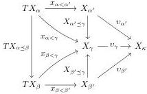

Furthermore, for any $\alpha \preceq \beta < \kappa$ we have a choice of $\alpha', \beta' < \gamma < \kappa$ and thus a commutative diagram

showing that $t_\beta \circ TX_{\alpha \preceq \beta} = t_\alpha$. Thus $(t_\alpha)_{\alpha < \kappa}$ is a cocone under $TX$. By the assumption that $TX_\kappa$ is the colimit of $TX$, then, we have a unique induced map $t: TX_\kappa \to X_\kappa$. For each $\alpha < \kappa$ we have

$$\begin{array}{l} t \circ \tau_{X_\kappa} \circ v_\alpha = t \circ T v_\alpha \circ \tau_{X_\alpha} \\ = v_{\alpha'} \circ x_{\alpha < \alpha'} \circ \tau_{X_\alpha} \\ = v_{\alpha'} \circ X_{\alpha \preceq \alpha'} \\ = v_\alpha, \end{array}$$

whence $t \circ \tau_{X_\kappa} = \mathrm{id}$. Thus $t$ exhibits $X_\kappa$ as a T-algebra.

**Proposition 2.2.9.** Every colimiting T-algebraized $\kappa$-chain is an initial object of T-AlgChain$_\kappa$.

*Proof.* By transfinite induction on $\kappa$. Let $(X, x), (Y, y) \in \mathsf{T}$-AlgChain$_\kappa$ where $(X, x)$ is colimiting. By induction hypothesis, we have for $\alpha < \kappa$ a unique morphism $\varphi^\alpha: (X, x) \upharpoonright \alpha \to (Y, y) \upharpoonright \alpha$ between the restrictions to T-AlgChain$_\kappa$. Note that by uniqueness, the restriction of $\varphi^\alpha$ to any $\beta < \alpha$ is identical with $\varphi^\beta$. Because $(X, x)$ is colimiting, we have for each $\alpha < \kappa$ a unique $\varphi_\alpha: X_\alpha \to Y_\alpha$ fitting into the diagram

$$\begin{array}{c} SX_\beta \xrightarrow{x_{\beta < \alpha}} X_\alpha \\ S\varphi_\beta^\alpha \Big\downarrow \qquad \qquad \qquad \qquad \qquad \qquad \qquad \qquad \qquad \qquad \qquad \qquad \qquad \qquad \qquad \qquad \qquad \qquad \qquad \qquad \qquad \qquad \qquad \qquad \qquad \qquad \qquad \qquad \qquad \qquad \qquad \qquad \qquad \qquad \\ SY_\beta \xrightarrow{y_{\beta < \alpha}} Y_\alpha \end{array} \tag{2.2}$$

for all $\beta < \alpha$. From Equation (2.2), we have that $\varphi_\beta = \varphi_\beta^\alpha$ for $\beta < \alpha$: for any $\gamma < \beta < \alpha$, we calculate that

$$\varphi_\beta \circ x_{\gamma < \beta} = y_{\gamma < \beta} \circ S\varphi_\gamma^\beta = y_{\gamma < \beta} \circ S\varphi_\gamma^\alpha = \varphi_\beta^\alpha \circ x_{\gamma < \beta}.$$

Thus (2.2) shows that $\varphi_\alpha$ is a morphism $\varphi: (X, x) \to (Y, y)$. Uniqueness of $\varphi$ follows from uniqueness of the $\varphi^\alpha$: if $\varphi: (X, x) \to (Y, y)$ is a morphism, then we know that $\varphi \upharpoonright \alpha = \varphi^\alpha$ for $\alpha < \kappa$ by induction hypothesis, so for any $\alpha < \kappa$ and $\beta < \alpha$ we have $\varphi_\alpha \circ x_{\beta < \alpha} = y_{\beta < \alpha} \circ S\varphi_\beta = y_{\beta < \alpha} \circ S\varphi_\beta^\alpha$.

**Lemma 2.2.10.** Let $\mathcal{E}$ be a category, $\mathcal{M} \hookrightarrow \mathcal{E}$ be a wide subcategory, and $S = (S, \sigma)$ be a well-pointed endofunctor on $\mathcal{E}$ such that $\sigma$ is valued in $\mathcal{M}$ and $\mathcal{M}$ has colimits of $\alpha$-chains in $\mathcal{E}$ for $\alpha < \kappa$. There is a colimiting S-algebraized $\kappa$-chain $(X, x)$ such that $X$ and $x$ factor through $\mathcal{M}$.

*Proof.* We go by transfinite induction on $\kappa$; suppose that we have such an algebraized $\alpha$-chain $(X^\alpha, x^\alpha)$ for all $\alpha < \kappa$. Define $X: \kappa \to \mathcal{E}$ on objects by $X_\alpha := \operatorname{colim}_\alpha SX^\alpha$ and write $v_\beta: SX_\beta^\alpha \to X_\alpha$ for the coprojections. For $\alpha \preceq \alpha'$, we have a unique isomorphism $X^{\alpha \preceq \alpha'}: (X^\alpha, x^\alpha) \cong (X^{\alpha'}, x^{\alpha'}) \upharpoonright \alpha$ by Proposition 2.2.9, which induces a transition map $X_{\alpha \preceq \alpha'} := \operatorname{colim}_\alpha SX^{\alpha \preceq \alpha'}: X_\alpha \to X_{\alpha'}$ in $\mathcal{M}$. For $\beta < \alpha < \kappa$, we have a unique $\theta_\beta^\alpha: X_\beta \to X_\beta^\alpha$ in $\mathcal{M}$ fitting in the diagram

$$\begin{array}{c} SX_\gamma^\beta \xrightarrow{v_\gamma} X_\beta \\ SX_\gamma^{\beta \preceq \alpha} \Big\downarrow \downarrow \qquad \qquad \qquad \qquad \qquad \qquad \qquad \qquad \qquad \qquad \qquad \qquad \qquad \qquad \qquad \qquad \qquad \qquad \qquad \qquad \qquad \qquad \qquad \qquad \qquad \qquad \qquad \qquad \qquad \qquad \qquad \qquad \qquad \qquad \\ SX_\gamma^\alpha \xrightarrow{x_{\gamma < \beta}^\alpha} X_\beta^\alpha \end{array}$$

13