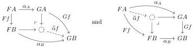
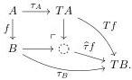

We recall Leibniz application of a natural transformation, an instance of the Leibniz construction exposited by Joyal and Tierney [JT07, §7] and Riehl and Verity [RV14, §4].

Definition 2.3.5. Let \(\alpha\colon F\to G\) be a natural transformation between functors \(F,G\colon\mathcal{C}\to\mathcal{D}\). The (Leibniz) pushout application \(\hat{\alpha}\colon\mathcal{C}^{-}\to\mathcal{D}^{-}\) and (Leibniz) pullback application \(\check{\alpha}\colon\mathcal{C}^{-}\to\mathcal{D}^{-}\), when they exist, are the functors sending \(f\colon A\to B\) in \(\mathcal{C}\) to the pushout and pullback gap maps

respectively.

Definition 2.3.6. Let \(\kappa > 0\) be a limit ordinal. The (large) category \(\mathrm{ConfMnd}_{\mathrm{p}}^{\kappa}\) of configurations for the free monad sequence on a pointed endofunctor is defined as follows.

(i) An object is a tuple \((\mathcal{E},\mathcal{M},\mathsf{T})\) of a category \(\mathcal{E}\), a wide subcategory \(\mathcal{M} \hookrightarrow \mathcal{E}\), and a pointed endofunctor \(\mathsf{T} = (T,\tau)\) on \(\mathcal{E}\) such that:

(a) \(\mathcal{M}\) is a \(\kappa\)-backdrop in \(\mathcal{E}\),
(b) \(\tau\) is valued in \(\mathcal{M}\),
(c) \(\mathcal{M}\) is closed under pushout application of \(\tau\),
(d) \(T\) preserves colimits of \(\kappa\)-chains in \(\mathcal{M}\).

(ii) A morphism from \((\mathcal{E}_1,\mathcal{M}_1,\mathsf{T}_1)\) to \((\mathcal{E}_2,\mathcal{M}_2,\mathsf{T}_2)\) is a morphism \((F,\gamma)\colon (\mathcal{E}_1,\mathsf{T}_1)\to (\mathcal{E}_2,\mathsf{T}_2)\) in \(\mathbf{PtdEndo}_s\) such that \(F\) defines a \(\kappa\)-backdrop-preserving functor \((\mathcal{E}_1,\mathcal{M}_1)\to (\mathcal{E}_2,\mathcal{M}_2)\).

Lemma 2.3.7. Let \((\mathcal{E},\mathcal{M},(T,\tau))\in \mathrm{ConfMnd}_{\mathrm{p}}^{\kappa}\) be a configuration. Then \(T\) preserves \(\mathcal{M}\).

Proof. For any \(f\colon A\to B\) in \(\mathcal{M}\), we have the diagram

The morphism from \( TA \) to the pushout object is a cobase change of \( f \), so belongs to \( \mathcal{M} \) by 2.3.6(a). The pushout gap map belongs to \( \mathcal{M} \) by 2.3.6(c). Thus their composite \( Tf \) belongs to \( \mathcal{M} \).

Remark 2.3.8. Let E be a category with a wide subcategory M and let  \( (T,\tau) \)  be a pointed endofunctor satisfying 2.3.6(a) and 2.3.6(b). If T preserves M and  \( \tau \)  is cartesian, then 2.3.6(c) holds whenever M is closed under “binary unions” in the sense that for any pullback square of the form

\[
\begin{array}{c} A \xrightarrow {\in \mathcal {M}} C \\ \mathcal {M} \ni \Big \downarrow^ {\lrcorner} \qquad \qquad \qquad \Big \downarrow \in \mathcal {M} \\ B \xrightarrow {\in \mathcal {M}} D \end{array}
\]

the pushout gap map is in \(\mathcal{M}\). In particular, this condition is satisfied when \(\mathcal{M}\) is the class of monomorphisms in an adhesive category [LS05, Theorem 5.1].

17