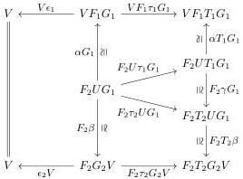
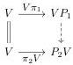

Proof. We have an isomorphism of spans

and thus an induced isomorphism of pushouts

as required.

Following Kelly, we reduce the construction of a free monad on a pointed endofunctor \(\mathsf{T}\) on \(\mathcal{E}\) to the construction of a free monad on a derived well-pointed endofunctor \(\mathsf{T}^{\varphi}\) on a category \(\mathcal{E}^{\varphi}\).

Notation 2.3.14. Let \(\mathcal{E}\) be a category and \(\mathcal{M}\) be a wide subcategory of \(\mathcal{E}\) closed under cobase change. Given a pointed endofunctor \(\mathsf{T} = (T,\tau)\) on \(\mathcal{E}\) whose unit is valued in \(\mathcal{M}\), write

\[
\mathcal {E} ^ {\rightarrow} \xrightarrow [ \leftarrow \tau^ {!} ]{\tau_ {*}} T \downarrow \mathcal {E}
\]

for the adjoint pair where \(\tau^{!}\colon T\downarrow \mathcal{E}\to \mathcal{E}^{\rightarrow}\) sends \((A,B,f\colon TA\to B)\) to \(f\tau_{A}\colon A\to B\) and \(\tau_{*}\) sends \(f\colon A\to B\) to the triple \((A,C,g\colon TA\to C)\) defined by the pushout

\[
\begin{array}{c} A \xrightarrow {\tau_ {A}} T A \\ f \Biggl \downarrow \quad \quad \quad \quad \quad \quad \quad \quad \quad \quad \quad \quad \quad \quad \quad \quad \quad \quad \quad \quad \quad \quad \quad \quad \quad \quad \quad \quad \quad \quad \quad \quad \quad \quad \quad \quad \quad \quad \quad \quad \quad \quad \quad \quad \quad \quad \quad \quad \quad \quad \text {   (2.7)   } \\ B \xrightarrow {} C, \end{array}
\]

which exists by closure of \(\mathcal{M}\) under cobase change in \(\mathcal{E}\).

Notation 2.3.15. Given a category \(\mathcal{E}\) and wide subcategory \(\mathcal{M} \hookrightarrow \mathcal{E}\), write \(\mathcal{E}_{\mathcal{M}}^{\rightarrow}\) for the full subcategory of \(\mathcal{E}^{\rightarrow}\) consisting of arrows in \(\mathcal{M}\).

Definition 2.3.16. Let \(\mathcal{E}\) be a category, \(\mathcal{M}\) be a wide subcategory of \(\mathcal{E}\) closed under cobase change, and \(\mathsf{T}\) be a pointed endofunctor on \(\mathcal{E}\). Define \(\mathcal{E}^{\varphi}\) via the following pullback, which is also a weak 2-pullback since \(\mathcal{M}\) is replete [JS93, Theorem 1]:

\[
\begin{array}{c} \mathcal {E} ^ {\varphi} \xrightarrow {} \mathcal {E} _ {\mathcal {M}} ^ {\rightarrow} \\ \vdots \\ T \downarrow \mathcal {E} \xrightarrow [ \tau^ {!} ]{} \mathcal {E} ^ {\rightarrow}. \end{array} \tag {2.8}
\]

19