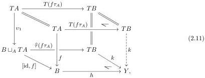
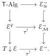
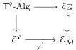

is given by functoriality of pushouts in the cube

and is thus identified as indicated above with a leg of the bottom pushout square. From this lower square, we see that $k\tau_B = k \circ \widehat{\tau}(f\tau_A) \circ v_0 = h \circ [\mathrm{id}, f] \circ v_0 = h$. Since we have established that $h$ is in $\mathcal{M}$, this shows that $(X, Y, k) \in \mathcal{E}^{\mathfrak{g}}$.

Finally, we check that the unit of $\mathsf{T}^{\mathfrak{g}}$ is valued in $\mathcal{M}^{\mathfrak{g}}$. At $(A, B, f) \in \mathcal{E}^{\mathfrak{g}}$, its value is the bottom horizontal map of (2.9). The domain component is simply $f\tau_A \colon A \to B$, which is in $\mathcal{M}$ by definition of $\mathcal{E}^{\mathfrak{g}}$. The codomain component is the bottom row of (2.10), which we have established is in $\mathcal{M}$.

**Lemma 2.3.21.** Let $(\mathcal{E}, \mathcal{M}, \mathsf{T}) \in \mathrm{ConfMnd}_{\mathrm{p}}^{\kappa}$. Observe that the forgetful functor $U_{\mathsf{T}} \colon \mathsf{T}\text{-Alg} \to \mathcal{E}$ factors as a composite

$$(A, f) \longmapsto (A, A, f)$$

$$\mathsf{T}\text{-Alg} \longrightarrow \mathcal{E}^{\mathfrak{g}} \longrightarrow \mathcal{E} \tag{2.12}$$

$$(A, B, f) \longmapsto A.$$

Over $\mathcal{E}^{\mathfrak{g}}$, the category $\mathsf{T}\text{-Alg} \to \mathcal{E}^{\mathfrak{g}}$ is equivalent to $U_{\mathsf{T}} \colon \mathsf{T}^{\mathfrak{g}}\text{-Alg} \to \mathcal{E}^{\mathfrak{g}}$.

*Proof.* Consider the composite square

The outer square is a weak 2-pullback and the lower square is the weak 2-pullback (2.8), so the upper square is a weak 2-pullback by pullback pasting. By Propositions 2.3.11 and 2.3.19, the square

is also a weak 2-pullback, so the result follows by uniqueness of weak 2-pullbacks up to equivalence.

**Lemma 2.3.22.** For any $(\mathcal{E}, \mathcal{M}, \mathsf{T}) \in \mathrm{ConfMnd}_{\mathrm{p}}^{\kappa}$, $\mathcal{M}^{\mathfrak{g}}$ has colimits of $(1 + \alpha)$-chains in $\mathcal{E}^{\mathfrak{g}}$ for all $\alpha < \kappa$.

21