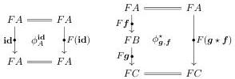
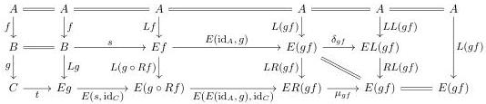

**Definition 3.1.7.** A double category $\mathbb{A}$ is *thin* when every square of $\mathbb{A}$ is uniquely determined by its boundary.

**Example 3.1.8.** For any category $\mathcal{E}$, there is a thin *double category of squares* $\operatorname{Sq}(\mathcal{E})$ whose objects are objects of $\mathcal{E}$, whose horizontal and vertical morphisms are both the morphisms of $\mathcal{E}$, and whose squares are commutative squares in $\mathcal{E}$.

**Definition 3.1.9.** A *pseudo double functor* $F: \mathbb{A} \to \mathbb{B}$ between pseudo double categories consists of functors $F_0: \mathbb{A}_0 \to \mathbb{B}_0$ and $F_1: \mathbb{A}_1 \to \mathbb{B}_1$ such that $\operatorname{dom}_{\downarrow} F_1 = F_0 \operatorname{dom}_{\downarrow}$ and $\operatorname{cod}_{\downarrow} F_1 = F_0 \operatorname{cod}_{\downarrow}$, together with horizontally invertible comparison squares

satisfying naturality and coherence conditions; again, we refer to Grandis and Paré [GP99, §7.2] for a complete definition. A *double functor* is a pseudo double functor for which the comparison isomorphisms above are identities, in which case the coherence conditions are automatically satisfied.

Bourke and Garner [BG16a] define a double category for (co)monad (co)algebras associated to an AWFS. The same definitions also yield a double category for (co)pointed endofunctor coalgebras:

**Definition 3.1.10** ([BG16a, §2]). For any AWFS $(\mathsf{L}, \mathsf{R})$ on a category $\mathcal{E}$, we have a double category $\mathsf{L}_{\mathsf{p}}$-Coalg in which

- (i) objects and horizontal morphisms are objects and morphisms of $\mathcal{E}$ respectively;
- (ii) vertical morphisms $(f, s): A \leftrightarrow B$ are morphisms $f: A \to B$ of $\mathcal{E}$ equipped with an $\mathsf{L}_{\mathsf{p}}$-coalgebra structure $s: B \to Ef$;
- (iii) squares

$$\begin{array}{c} A \xrightarrow{h} C \\ f \downarrow \qquad \qquad \qquad \qquad \qquad \qquad \downarrow g \\ B \xrightarrow{k} D \end{array}$$

are morphisms $(h, k): f \to g$ in $\mathsf{L}_{\mathsf{p}}$-Coalg.

In other words, we set $\mathsf{L}_{\mathsf{p}}$-Coalg$^{\downarrow} := \mathsf{L}_{\mathsf{p}}$-Coalg.

The vertical identities are given by $\mathbf{id}_A := (\mathrm{id}_A, L(\mathrm{id}_A)): A \leftrightarrow A$. The vertical composition of morphisms $(g, t): B \leftrightarrow C$ and $(f, s): A \leftrightarrow B$ is given by the pair $(gf, u)$ where $u$ is the bottom horizontal composite of the rectangle

which defines a section of $\Phi_{gf}$. We leave the unit and associativity laws for vertical composition as a tedious exercise for the reader. The forgetful functor from $\mathsf{L}_{\mathsf{p}}$-Coalg extends to a double functor $U_{\mathsf{L}_{\mathsf{p}}}: \mathsf{L}_{\mathsf{p}}$-Coalg $\to \operatorname{Sq}(\mathcal{E})$.

26