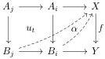
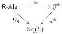

Restricting to those vertical morphisms which are coalgebras for the comonad L, we likewise have the double category L-Coalg and forgetful double functor $U_{\mathsf{L}} : \mathsf{L}$-Coalg $\to \mathsf{Sq}(\mathcal{E})$ as defined by Bourke and Garner. By the self-duality of AWFS's, we also have double categories $U_{\mathsf{R}} : \mathsf{R}$-Alg $\to \mathsf{Sq}(\mathcal{E})$ and $U_{\mathsf{R}_{\mathsf{p}}} : \mathsf{R}_{\mathsf{p}}$-Alg $\to \mathsf{Sq}(\mathcal{E})$ whose vertical morphisms are algebras for the monad of the AWFS and its underlying pointed endofunctor.

### 3.1.3 Cofibrant generation

Now we can recall what it means for an AWFS $(\mathsf{L}, \mathsf{R})$ to be cofibrantly generated by a diagram $u : \mathcal{J} \to \mathcal{E}^{\neg}$, namely that an $\mathsf{R}$-algebra on a map consists of a coherent choice of lifts against $u$.

Definition 3.1.11 ([BG16a, §5.2]). Given a diagram $u : \mathcal{J} \to \mathcal{E}^{\neg}$, write $u^{\spadesuit} : \mathcal{J}^{\spadesuit} \to \mathsf{Sq}(\mathcal{E})$ for the double category in which

(i) objects and horizontal morphisms are objects and morphisms of $\mathcal{E}$ respectively;
(ii) vertical morphisms $(f, \psi) : X \to Y$ are morphisms in $\mathcal{E}$ equipped with a choice of filler $\psi(i, \alpha)$ for each lifting problem $\alpha : u_i \to f$ such that for every $t : j \to i$ in $\mathcal{J}$ and $\alpha : u_i \to f$, the triangle

formed by $\psi(i, \alpha)$ and $\psi(j, \alpha u_t)$ commutes;

(iii) squares

$$\begin{array}{c} X \xrightarrow{x} X' \\ (f, \psi) \downarrow \quad \beta \quad \downarrow (f', \psi') \\ Y \xrightarrow{y} Y' \end{array}$$

are commutative squares $\beta = (x, y) : f \to f'$ in $\mathcal{E}$ such that for each lifting problem $\alpha : u_i \to f$, we have $\psi'(i, \beta \alpha) = x \psi(i, \alpha)$.

For identity and composition of vertical morphisms in $\mathcal{J}^{\spadesuit}$, we use the standard arguments that a class of maps defined by a lifting property contains all identities and is closed under composition.

Notation 3.1.12 (cf. [Gar09, Proposition 3.8]). Given $u : \mathcal{J} \to \mathcal{E}^{\neg}$, we write $\mathcal{J}^{\flat}$ for the category of vertical morphisms of $\mathcal{J}^{\spadesuit}$ and $u^{\flat} : \mathcal{J}^{\flat} \to \mathcal{E}^{\neg}$ for the underlying map functor.

Definition 3.1.13. Let $\mathcal{E}$ be a category and $u : \mathcal{J} \to \mathcal{E}^{\neg}$ be a diagram of arrows. An AWFS $(\mathsf{L}, \mathsf{R})$ on $\mathcal{E}$ is cofibrantly generated by $u$ when we have an isomorphism

of double categories.

The projection sending an AWFS to its double category of $\mathsf{R}$-algebras is 2-fully faithful [BG16a, Proposition 2], so the AWFS cofibrantly generated by a category is unique up to isomorphism if it exists. Bourke and Garner also define what it means for an AWFS to be generated by a double functor $\mathbb{J} \to \mathsf{Sq}(\mathcal{E})$ [BG16a, §6], but we will not consider this more general case.

27