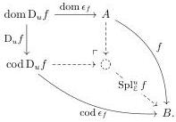

**Definition 3.2.8.** Let $\mathcal{E}$ be a category with a $\kappa$-backdrop $\mathcal{M}$. An object $A \in \mathcal{E}$ is $(\kappa, \mathcal{M})$-small when $\mathcal{E}(A, -)$ preserves colimits of $\kappa$-chains in $\mathcal{M}$.

**Definition 3.2.9.** Let $\mathcal{E}$ be a category, $\kappa > 0$ be a limit ordinal, $\mathcal{M}$ be a $\kappa$-backdrop in $\mathcal{E}$, and $u: \mathcal{J} \to \mathcal{E}^\to$ be compatible with $\mathcal{M}$. We define a pointed endofunctor $\mathsf{Spl}_\mathcal{E}^u = (\mathsf{Spl}_\mathcal{E}^u, \mathsf{spl}^u)$ on $\mathcal{E}^\to$ by the pushout diagram

$$\begin{array}{c} \mathrm{D}_{u} \xrightarrow{\mathrm{tgt} \mathrm{D}_{u}} \mathrm{Tgt}_{\mathcal{E}} \mathrm{D}_{u} \\ \epsilon \Big\downarrow \qquad \qquad \qquad \qquad \qquad \qquad \qquad \qquad \qquad \qquad \qquad \qquad \qquad \qquad \qquad \qquad \qquad \qquad \qquad \qquad \qquad \qquad \qquad \qquad \qquad \qquad \qquad \qquad \qquad \qquad \qquad \qquad \qquad \qquad \\ \mathrm{Id}_{\mathcal{E}^\to} \xrightarrow{\mathsf{spl}^u} \mathrm{Spl}_\mathcal{E}^u, \end{array}$$

where $\mathsf{Tgt}_\mathcal{E}$ is the pointed endofunctor of Definition 2.3.18 and $\epsilon$ is the counit of the density comonad. Note that this pushout exists by assumption that $u$ is compatible with $\mathcal{M}$.

Unpacked, $\mathsf{Spl}_\mathcal{E}^u$ sends a morphism $f: A \to B$ to the pushout gap map

of the counit of the density comonad, while the unit map $\mathsf{spl}^u: f \to \mathsf{Spl}_\mathcal{E}^u f$ is the right triangle in the diagram above.

**Proposition 3.2.10.** Let $\mathcal{E}$ be a category, $\kappa > 0$ be a limit ordinal, $\mathcal{M}$ be a $\kappa$-backdrop in $\mathcal{E}$, and $u: \mathcal{J} \to \mathcal{E}^\to$ be compatible with $\mathcal{M}$. Then we have an isomorphism $\mathcal{J}^\oplus \cong \mathsf{Spl}_\mathcal{E}^u$-Alg over $\mathcal{E}^\to$.

*Proof.* A $\mathsf{Spl}_\mathcal{E}^u$-algebra structure $\mathsf{Spl}_\mathcal{E}^u f \to f$ on $f: A \to B$ is determined by a map $h: \operatorname{cod} \mathrm{D}_u f \to A$ fitting into the diagram

$$\begin{array}{c} A \xrightarrow{\nu_0} A \sqcup_{\operatorname{dom} \mathrm{D}_u f} \operatorname{cod} \mathrm{D}_u f \xrightarrow{[\operatorname{id}_A, h]} A \\ f \Big\downarrow \qquad \qquad \qquad \qquad \qquad \qquad \qquad \qquad \qquad \qquad \qquad \qquad \qquad \qquad \qquad \qquad \qquad \qquad \qquad \qquad \qquad \qquad \qquad \qquad \qquad \qquad \qquad \qquad \qquad \qquad \qquad \qquad \qquad \qquad \\ B \xlongequal{\text{ }} B \xlongequal{\text{ }} B. \end{array} \tag{3.1}$$

Such a map consists, by universal property of the colimit defining $\operatorname{cod} \mathrm{D}_u$, of an assignment sending each $i \in \mathcal{J}$ and $\alpha: u_i \to f$ to a map $h\nu_\alpha: \operatorname{cod} u_i \to A$, coherently with respect to the morphisms of $\mathcal{J}$, and the diagram (3.1) requires precisely that the diagrams

$$\begin{array}{c} \operatorname{dom} u_i \xrightarrow{\operatorname{dom} \alpha} A \\ u_i \Big\downarrow \qquad \qquad \qquad \qquad \qquad \qquad \qquad \qquad \qquad \qquad \qquad \qquad \qquad \qquad \qquad \qquad \qquad \qquad \qquad \qquad \qquad \qquad \qquad \qquad \qquad \qquad \qquad \qquad \qquad \qquad \qquad \qquad \qquad \qquad \\ \operatorname{cod} u_i \xrightarrow{\operatorname{cod} \alpha} B \end{array}$$

commute, *i.e.*, that each output is a solution to the input lifting problem. A morphism of $\mathsf{Spl}_\mathcal{E}^u$-algebras is similarly seen to correspond to a morphism of $\mathcal{J}^\oplus$. $\square$

**Lemma 3.2.11.** Let $\mathcal{E}$ be a cocomplete category with a $\kappa$-backdrop $\mathcal{M}$ and let $u: \mathcal{J} \to \mathcal{E}^\to$ be a diagram compatible with $\mathcal{M}$. If $\operatorname{dom} u: \mathcal{J} \to \mathcal{E}$ is levelwise $(\kappa, \mathcal{M})$-small for some $\kappa > 0$, then $\mathsf{Spl}_\mathcal{E}^u$ preserves colimits of $\kappa$-chains in $\mathcal{E}^\to(\frac{\mathcal{M}}{\cong})$.

29