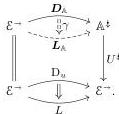

extensions of the copointed and pointed endofunctors $(L, \Phi)$ and $(R, \Lambda)$ defined by the squares

$$\begin{array}{c} X \xlongequal{\quad} X \\ Lf \downarrow \quad \Phi_f \quad \downarrow f \\ Ef \xrightarrow[Rf]{} Y \end{array} \quad \text{and} \quad \begin{array}{c} X \xrightarrow{Lf} Ef \\ f \downarrow \quad \Lambda_f \quad \downarrow Rf \\ Y \xlongequal{\quad} Y \end{array}$$

to a comonad $\mathsf{L} = (L, \Phi, \Sigma)$ and monad $\mathsf{R} = (R, \Lambda, \Pi)$ related by a distributive law [Bec69]. An AWFS has an underlying WFS whose left maps are the coalgebras for the copointed endofunctor $\mathsf{L}_p = (L, \Phi)$ and whose right maps are the algebras for the pointed endofunctor $\mathsf{R}_p = (R, \Lambda)$ [Gar09, Remark 2.17] [Rie11, Remark 2.11].

Given an AWFS on $\mathcal{E}$, Bourke and Garner [BG16a] describe a double category $\mathsf{L}_p$-Coalg whose objects and horizontal morphisms are those of $\mathcal{E}$ and whose category of vertical morphisms is the category $\mathsf{L}_p$-Coalg of left maps. It lives over $\mathcal{E}$ via the double functor $U: \mathsf{L}_p$-Coalg $\to \mathbb{S}q(\mathcal{E})$ (to the “double category of squares” on $\mathcal{E}$ whose horizontal and vertical morphisms are both the morphisms of $\mathcal{E}$) that forgets the left structure on vertical morphisms. Abstracting from this situation, we define a *notion of composable structure on $\mathcal{E}$* (Definition 3.3.1) to be a pseudo double category $U: \mathbb{A} \to \mathbb{S}q(\mathcal{E})$ over $\mathbb{S}q(\mathcal{E})$ whose horizontal morphisms are those of $\mathcal{E}$ and whose vertical morphism projection $U^\sharp: \mathbb{A}^\sharp \to \mathcal{E}^\to$ is a conservative isofibration.

A notion of composable structure $U: \mathbb{A} \to \mathbb{S}q(\mathcal{E})$ will be *cellular* when its category of vertical morphisms $\mathbb{A}^\sharp$ is closed under certain pushouts and sequential colimits. Given a diagram of generators $u: \mathcal{J} \to \mathcal{E}^\to$, its *density comonad* $\mathsf{D}_u: \mathcal{E}^\to \mathcal{E}^\to$ [Koc66] is the pointwise left Kan extension of $u$ along itself, defined at $f \in \mathcal{E}^\to$ by

$$\mathsf{D}_u(f) := \operatorname{colim} \left( u \downarrow f \xrightarrow{\pi} \mathcal{J} \xrightarrow{u} \mathcal{E}^\to \right). \tag{1.2}$$

When $\mathcal{J}$ is discrete, $\mathsf{D}_u(f)$ is the coproduct $\coprod_{i \in \mathcal{J}, \alpha: u_i \to f} u_i$, and in general it plays an analogous role to the coproducts in Quillen’s argument. Importantly, it can be effectively characterized in our examples of interest (Section 4.1).

Our first main theorem turns any lift of $\mathsf{D}_u$ through a cellular notion of composable structure $\mathbb{A}$ into a corresponding of the left factor functor $L$ of the AWFS generated from $u$. To be precise:

**Theorem 3.5.6.** Fix a category $\mathcal{E}$ equipped with a $\kappa$-backdrop $\mathcal{M}$, a diagram $u: \mathcal{J} \to \mathcal{E}^\to$ compatible with $\mathcal{M}$ such that $\operatorname{dom} u$ is levelwise $(\kappa, \mathcal{M})$-small, and a left-connected, $(\kappa, \mathcal{M})$-cellular notion of composable structure $U: \mathbb{A} \to \mathbb{S}q(\mathcal{E})$. If $(\mathsf{L}, \mathsf{R})$ is the AWFS cofibrantly generated by $u$, then any lift $\mathbf{D}_{\mathbb{A}}: \mathcal{E}^\to \mathbb{A}^\sharp$ of $\mathsf{D}_u$ through $U^\sharp$ induces lifts $\mathbf{L}_{\mathbb{A}}$ of $L$ and $\gamma: \mathbf{D}_{\mathbb{A}} \to \mathbf{L}_{\mathbb{A}}$ of $\operatorname{step}_u: \mathsf{D}_u \to L$ through $U^\sharp$, as in the diagram

Theorem 3.5.6 is a corollary of a more technical result, Theorem 3.5.5, that expresses a universal property of the outputs. The backdrop parameter $\mathcal{M}$, a wide subcategory of $\mathcal{E}$, is new relative to the classical story and controls the kind of colimits required in $\mathcal{E}$ and $\mathbb{A}^\sharp$. We expand on the intuition and motivation for this setup in Section 1.2. For now, we summarize the definitions:

- a wide subcategory $\mathcal{M} \hookrightarrow \mathcal{E}$ is a $\kappa$-*backdrop* if $\mathcal{M}$ has colimits of $(1 + \alpha)$-chains for $\alpha < \kappa$ preserved by $\mathcal{M} \hookrightarrow \mathcal{E}$, $\kappa$-chains in $\mathcal{M}$ have colimits in $\mathcal{E}$, and $\mathcal{M}$ is closed under cobase change (Definition 2.3.2);

3