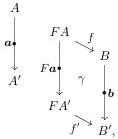
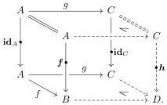
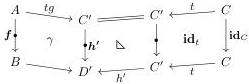

\( a: A \leftrightarrow A' \) , vertical morphism  \( b: B \leftrightarrow B' \) , and square  \( \gamma \)  of B fitting in the diagram

i.e., an object of the comma category \(F_{1} \downarrow \mathbb{B}_{1}\);

(d) a square is a morphism of the comma category \( F_{1} \downarrow \mathbb{B}_{1} \), i.e., a pair of a square \( \alpha \) in \( \mathbb{A} \) and square \( \beta \) in \( \mathbb{B} \) fitting into the evident commutative diagram in \( \mathbb{B}_{1} \).

We refer to Grandis and Paré [GP04, §2.5] for the remaining details.

Definition 3.5.2. Let \(U: \mathbb{A} \to \mathbb{S}\mathrm{q}(\mathcal{E})\) be a notion of composable structure on \(\mathcal{E}\). We write \(U_{\mathrm{gl}}: \mathbb{G}\mathrm{l}(U) \to \mathbb{S}\mathrm{q}(\mathcal{E}^{-})\) for the glued notion of composable structure with \(\mathbb{G}\mathrm{l}(U) := U \downarrow \mathbb{S}\mathrm{q}(\mathcal{E})\) and \(U_{\mathrm{gl}}\) defined on vertical morphisms by \(U_{\mathrm{gl}}(\boldsymbol{a}, b, \gamma) := (a, b)\). We write \(\operatorname{dom}_{\mathrm{gl}}: \mathbb{G}\mathrm{l}(U) \to \mathbb{A}\) for the domain projection.

Proposition 3.5.3. Let \( U \colon \mathbb{A} \to \mathbb{S}\mathrm{q}(\mathcal{E}) \) be a notion of composable structure. If \( U \) is left-connected, then \( U_{\mathrm{gl}} \colon \mathbb{G}\mathrm{l}(U) \to \mathbb{S}\mathrm{q}(\mathcal{E}^{-}) \) is also left-connected.

Lemma 3.5.4. Let \(U: \mathbb{A} \to \mathbb{S}\mathrm{q}(\mathcal{E})\) be a left-connected notion of composable structure. Let \(\mathcal{M}\) be a wide subcategory of \(\mathcal{E}\) such that \(\mathbb{A}^{\sharp}(\frac{\cong}{\mathcal{M}})\) is closed under cobase change in \(\mathbb{A}^{\sharp}\) and these pushouts are preserved by \(U^{\sharp}\). Then given \(\boldsymbol{f}: A \leftrightarrow B\) in \(\mathcal{M}\) and \(g: A \to C\), we have a square

\[
\begin{array}{c c c} A & \xrightarrow {g} & C \\ f \Big \downarrow & \beta & \Big \downarrow \\ B & \dashrightarrow & D \end{array}
\]

which is an opcartesian lift of \( \pmb{f} \) along \( g \) in \( \mathrm{dom}_{\mathbb{L}}\colon \mathbb{A}^{\mathbb{L}}\to \mathcal{E} \) and is sent to a pushout square by \( U \). Proof. Given \( \pmb{f}\colon A\leftrightarrow B \) in \( \mathcal{M} \) and \( g\colon A\to C \), the left connection \( \mathbf{id}_A\to \pmb{f} \) belongs to \( \mathbb{A}^{\mathbb{L}}(\frac{\cong}{\mathcal{M}}) \), so we can form its pushout along \( \mathbf{id}_g\colon \mathbf{id}_A\to \mathbf{id}_C \), yielding a cube of the form

The front face is our opcartesian lift \(\beta\). Its universal property follows straightforwardly from the universal property of the pushout: for any \(t: C \to C'\) and square \(\gamma: f \to h'\) under \(tg\), we get a cocone

35