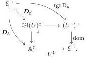

under $f \leftarrow \mathbf{id}_A \rightarrow \mathbf{id}_C$ which then induces a factorization of $\gamma$ through $\alpha$. That the square is a pushout in $\mathcal{E}$ follows from pushout pasting, as the back face of the cube is also a pushout in $\mathcal{E}$. $\square$

We now prove our first main theorem, which exhibits the left-coalgebras of a cofibrantly generated AWFS as the least cellular notion of composable structure containing the generators. Although the statement of the following theorem makes clear that its output is unique with some properties, the useful data of that output is buried in the notion of $\mathbb{G}\mathrm{l}(U)$-point. We extract this data in Theorem 3.5.6.

**Theorem 3.5.5.** Fix a category $\mathcal{E}$ equipped with a $\kappa$-backdrop $\mathcal{M}$, a diagram $u: \mathcal{J} \to \mathcal{E}^\to$ compatible with $\mathcal{M}$ such that $\operatorname{dom} u$ is levelwise $(\kappa, \mathcal{M})$-small, and a left-connected, $(\kappa, \mathcal{M})$-cellular notion of composable structure $U: \mathbb{A} \to \mathbb{S}\mathrm{q}(\mathcal{E})$. If $(\mathsf{L}, \mathsf{R})$ is the AWFS cofibrantly generated by $u$, then any lift $D_\mathbb{A}: \mathcal{E}^\to \mathbb{A}^\sharp$ of $\mathrm{D}_u$ through $U^\sharp$ induces an essentially unique $\mathbb{G}\mathrm{l}(U)$-point $(\overline{\mathsf{R}}, \theta)$ over $\mathsf{R}$ with a natural transformation $\gamma: D_\mathbb{A} \to \operatorname{dom}_{\mathrm{gl}} \overline{\mathsf{R}}\mathbf{id}$ such that $U^\sharp \gamma = \operatorname{step}_u$.

*Proof.* The AWFS cofibrantly generated by $u$ exists by Theorem 3.2.12. Recall from the proof of Theorem 3.2.12 that $\mathsf{R}$ is the free monad on $\mathsf{Spl}_\mathcal{E}^u$. We aim to apply Theorem 3.4.4 with the configuration $(\mathcal{E}^\to, \mathcal{E}^\to(\frac{\mathcal{M}}{\cong}), \mathsf{Spl}_\mathcal{E}^u) \in \mathrm{ConfMnd}_\mathrm{p}^\kappa$ established in the proof of Theorem 3.2.12 to obtain a $\mathbb{G}\mathrm{l}(U)$-point over $\mathsf{R}$. Observe that $U_{\mathrm{gl}}: \mathbb{G}\mathrm{l}(U) \to \mathbb{S}\mathrm{q}(\mathcal{E}^\to)$ is $(\kappa, \mathcal{E}^\to(\frac{\mathcal{M}}{\cong}))$-cellular, as required, by the assumption that $U$ is $(\kappa, \mathcal{M})$-cellular.

It remains to construct a $\mathbb{G}\mathrm{l}(U)$-point over $\mathsf{Spl}_\mathcal{E}^u$. Recall that $\mathsf{spl}^u$ is the cobase change of $\operatorname{tgt} \mathrm{D}_u: \mathrm{D}_u \to \mathrm{Tgt}_\mathcal{E} \mathrm{D}_u$ along the counit $\epsilon: \mathrm{D}_u \to \mathrm{Id}_{\mathcal{E}^\to}$. By definition of $\mathbb{G}\mathrm{l}(U)$, $D_\mathbb{A}$ induces a lift of $\operatorname{tgt} \mathrm{D}_u$ through $U_{\mathrm{gl}}$:

By Lemma 3.5.4, we have opcartesian lifts

$$\begin{array}{c} \mathrm{D}_u \xrightarrow{\epsilon} \mathrm{Id}_{\mathcal{E}^\to} \\ D_{\mathrm{gl}} \downarrow \quad \beta \quad \downarrow \tau \\ \mathrm{Tgt}_\mathcal{E} \mathrm{D}_u \longrightarrow \mathrm{Spl}_\mathcal{E}^u, \end{array} \tag{3.4}$$

living over pushout squares in $\mathcal{E}^\to$, which define a lift $\boldsymbol{\tau}: \mathcal{E}^\to \mathbb{G}\mathrm{l}(U)^\sharp$ of $\mathsf{spl}^u$ through $U_{\mathrm{gl}}^\sharp$. Since $\mathbb{G}\mathrm{l}(U)$ is left-connected, such a lift determines a $\mathbb{G}\mathrm{l}(U)$-point $((\boldsymbol{\tau}, \Delta), \alpha)$ over $\mathsf{Spl}_\mathcal{E}^u$ as described in Remark 3.4.3.

Theorem 3.4.4 now gives a $\mathbb{G}\mathrm{l}(U)$-point $(\overline{\mathsf{R}}, \theta)$ over $\mathsf{R}$ and morphism $\overline{\gamma}: ((\boldsymbol{\tau}, \Delta), \alpha) \to (\overline{\mathsf{R}}, \theta)$ over the canonical map $\mathsf{Spl}_\mathcal{E}^u \to \mathsf{R}_\mathrm{p}$. We obtain $\gamma_f: D_\mathbb{A}(f) \to \operatorname{dom}_{\mathrm{gl}} \overline{\mathsf{R}}(\mathbf{id}_f)$ for $f: A \to B$ as the composite

$$D_\mathbb{A}(f) = \operatorname{dom}_{\mathrm{gl}} D_{\mathrm{gl}}(f) \xrightarrow{\operatorname{dom}_{\mathrm{gl}} \beta_f} \operatorname{dom}_{\mathrm{gl}} \boldsymbol{\tau}_f \xrightarrow{\cong} \operatorname{dom}_{\mathrm{gl}} (\boldsymbol{\tau}_f \star \mathbf{id}_f) \xrightarrow{\operatorname{dom}_{\mathrm{gl}} \overline{\gamma}_{\mathbf{id}_f}} \operatorname{dom}_{\mathrm{gl}} \overline{\mathsf{R}}(\mathbf{id}_f).$$

To see essential uniqueness, suppose we have a $\mathbb{G}\mathrm{l}(U)$-point $(\overline{\mathsf{R}}', \theta')$ over $\mathsf{R}$ and a natural transformation $\gamma': D_\mathbb{A} \to \operatorname{dom}_{\mathrm{gl}} \overline{\mathsf{R}}'\mathbf{id}$ such that $U^\sharp \gamma' = \operatorname{step}_u$. The latter extends to some $D_{\mathrm{gl}} \to \overline{\mathsf{R}}'\mathbf{id}$ which by the opcartesian property of $\beta$ factors through a transformation $\boldsymbol{\tau} \to \overline{\mathsf{R}}'\mathbf{id}$. The latter transformation extends to a morphism of $\mathbb{G}\mathrm{l}(U)$-points $((\boldsymbol{\tau}, \Delta), \alpha) \to (\overline{\mathsf{R}}', \theta')$ over $\mathsf{Spl}_\mathcal{E}^u \to \mathsf{R}_\mathrm{p}$. Finally, the universal property of $(\overline{\mathsf{R}}, \theta)$ implies that there is a morphism $(\overline{\mathsf{R}}, \theta) \to (\overline{\mathsf{R}}', \theta')$ over the identity on $\mathsf{R}$. Because $U^\sharp$ is conversative, it must be an isomorphism. $\square$

36