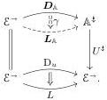

As a corollary:

**Theorem 3.5.6.** Fix a category $\mathcal{E}$ equipped with a $\kappa$-backdrop $\mathcal{M}$, a diagram $u: \mathcal{J} \to \mathcal{E}^\neg$ compatible with $\mathcal{M}$ such that $\operatorname{dom} u$ is levelwise $(\kappa, \mathcal{M})$-small, and a left-connected, $(\kappa, \mathcal{M})$-cellular notion of composable structure $U: \mathbb{A} \to \operatorname{Sq}(\mathcal{E})$. If $(\mathsf{L}, \mathsf{R})$ is the AWFS cofibrantly generated by $u$, then any lift $\boldsymbol{D}_{\mathbb{A}}: \mathcal{E}^\neg \to \mathbb{A}^\sharp$ of $\mathrm{D}_u$ through $U^\sharp$ induces lifts $\boldsymbol{L}_{\mathbb{A}}$ of $L$ and $\gamma: \boldsymbol{D}_{\mathbb{A}} \to \boldsymbol{L}_{\mathbb{A}}$ of $\operatorname{step}_u: \mathrm{D}_u \to L$ through $U^\sharp$, as in the diagram

*Proof.* By Theorem 3.5.5, we have a $\operatorname{Gl}(U)$-point $(\overline{\mathsf{R}}, \theta)$ over $\mathsf{R}$ and some $\gamma: \boldsymbol{D}_{\mathbb{A}} \to \operatorname{dom}_{\operatorname{gl}} \overline{\mathsf{R}}\mathbf{id}$ such that $U^\sharp \gamma = \operatorname{step}_u$. Recall that $L: \mathcal{E}^\neg \to \mathcal{E}^\neg$ is the domain component of the unit of $\mathsf{R}$; we may thus define $\boldsymbol{L}_{\mathbb{A}} := \operatorname{dom}_{\operatorname{gl}} \overline{\mathsf{R}}\mathbf{id}$, in which case $\gamma$ is the desired transformation $\boldsymbol{D}_{\mathbb{A}} \to \boldsymbol{L}_{\mathbb{A}}$. $\square$

**Proposition 3.5.7.** In the situation of Theorem 3.5.6, we have some $\overline{\mu}: \boldsymbol{L}_{\mathbb{A}}R \star \boldsymbol{L}_{\mathbb{A}} \to \boldsymbol{L}_{\mathbb{A}}$ lifting $(\operatorname{id}, \mu): LR \star L \to L$.

*Proof.* Again using the output of Theorem 3.5.5, we extract $\overline{\mu}$ from the multiplication for $\overline{\mathsf{R}}$ like so:

$$\boldsymbol{L}_{\mathbb{A}} R f \star \boldsymbol{L}_{\mathbb{A}} f = \operatorname{dom}_{\operatorname{gl}} (\overline{R}(\mathbf{id}_{R f}) \star \overline{R}(\mathbf{id}_f)) \xrightarrow[\cong]{\theta} \operatorname{dom}_{\operatorname{gl}} \overline{R}(\overline{R}(\mathbf{id}_f)) \longrightarrow \operatorname{dom}_{\operatorname{gl}} \overline{R}(\mathbf{id}_f) = \boldsymbol{L}_{\mathbb{A}} f. \quad \square$$

In the remainder of this section, we consider the problem of extending structure from the *free* left maps to *all* left maps, which is to say all $\mathsf{L}_{\mathsf{p}}$-coalgebras. The traditional story is that any left map of a WFS is a (codomain) retract of the left factor of its factorization, so any cellular class of maps closed under retracts which contains the generators of a cofibrantly generated WFS will contain every left map. The same logic applies here: if we are in the situation of Theorem 3.5.6 and know that every retract of an $\mathbb{A}$-structured map admits an $\mathbb{A}$-structure, then we can assign an $\mathbb{A}$-structure to every $\mathsf{L}_{\mathsf{p}}$-coalgebra. In the algebraic situation, however, it is natural to investigate when we can get a functorial or pseudo double functorial assignment of $\mathbb{A}$-structures to $\mathsf{L}_{\mathsf{p}}$-coalgebras.

**Definition 3.5.8.** The *walking retract* is the category generated by the graph

$$0 \xrightarrow{\mathsf{s}} 1 \xrightarrow{\mathsf{r}} 0$$

and equation $\mathsf{rs} = \operatorname{id}$. Given a category $\mathcal{E}$, its *category of retracts* $\operatorname{Ret}(\mathcal{E})$ is the category of functors from the walking retract to $\mathcal{E}$. Write $e_0, e_1: \operatorname{Ret}(\mathcal{E}) \to \mathcal{E}$ for evaluation at 0 and 1 respectively and $\Delta: \mathcal{E} \to \operatorname{Ret}(\mathcal{E})$ for the functor sending $A \in \mathcal{E}$ to the identity retract $A \xrightarrow{\equiv} A \xrightarrow{\equiv} A$.

**Definition 3.5.9.** Given a category $\mathcal{E}$, its *category of codomain retracts* $\operatorname{CodRet}(\mathcal{E})$ is the pullback

$$\begin{array}{ccc} \operatorname{CodRet}(\mathcal{E}) & \longrightarrow & \operatorname{Ret}(\mathcal{E}^\neg) \\ \downarrow{\scriptstyle{\text{Id}}} & & \downarrow{\scriptstyle{\text{Ret}}(\operatorname{dom})} \\ \mathcal{E} & \xrightarrow{\Delta} & \operatorname{Ret}(\mathcal{E}), \end{array}$$

*i.e.*, the subcategory of $\operatorname{Ret}(\mathcal{E}^\neg)$ consisting of retract diagrams $g \xrightarrow{\alpha} f \xrightarrow{\beta} g$ in $\mathcal{E}^\neg$ such that $\operatorname{dom} \alpha = \operatorname{dom}_{\sharp} \beta = \operatorname{id}$.

37