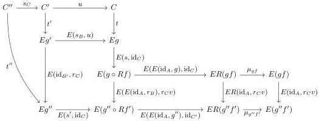

Example 3.5.15. Given an AWFS \((\mathsf{L},\mathsf{R})\) on a category \(\mathcal{E}\), the codomain retract lifting operator on \(U_{\mathsf{L}_{\mathfrak{p}}}\colon \mathsf{L}_{\mathfrak{p}}\text{-Coalg} \to \mathbb{S}\mathfrak{q}(\mathcal{E})\) described in Example 3.5.11 is compositional.

Proof. Suppose we have diagrams as in (3.6). Write  \( \boldsymbol{f} = (f, s) \colon A \leftrightarrow B \) ,  \( \boldsymbol{g} = (g, t) \colon B \leftrightarrow C \) , and  \( \boldsymbol{g}' = (g', t') \colon B' \leftrightarrow C' \)  for the coalgebras. Because  \( (s_B, u) \colon \boldsymbol{g}' \to \boldsymbol{g} \)  is a morphism of coalgebras, we have in particular  \( t \circ u = E(s_B, u) \circ t' \) .

Recall that the coalgebra structure on  \( (g,t)\star(f,s) \)  is given by the composite

\[
C \xrightarrow [ t ]{} E g \xrightarrow [ E (s , \mathrm{id} _ {C}) ]{} E (g \circ R f) \xrightarrow [ E (E (\mathrm{id} _ {A} , g) , \mathrm{id} _ {C}) ]{} E R (g f) \xrightarrow [ \mu_ {g f} ]{} E (g f). \tag {3.7}
\]

Lifting (3.7) along the retract \( g''f' \to gf \to g''f' \) consists in pre-composing with \( s_C u \colon C'' \to C \) and post-composing with \( E(\mathrm{id}_A, r_C v) \colon E(gf) \to E(g''f') \). Writing \( s' = E(\mathrm{id}_A, r_B) \circ s \circ s_B \) for the lifted coalgebra structure on \( f' \), and \( t'' = E(\mathrm{id}_B, r_C) \circ t' \circ s_C \) for the lifted structure on \( g'' \), we see from the diagram

that the necessary coherence holds.

Theorem 3.5.16. Fix a category \(\mathcal{E}\) equipped with a \(\kappa\)-backdrop \(\mathcal{M}\), a diagram \(u: \mathcal{J} \to \mathcal{E}^{-}\to\) compatible with \(\mathcal{M}\) such that \(\operatorname{dom} u\) is levelwise \((\kappa, \mathcal{M})\)-small, and a thin, left-connected, \((\kappa, \mathcal{M})\)-cellular notion of composable structure \(U: \mathbb{A} \to \mathbb{S}\mathrm{q}(\mathcal{E})\) with a compositional codomain retract lifting operator. Write \((\mathsf{L}, \mathsf{R})\) for the AWFS cofibrantly generated by \(u\), which exists by Theorem 3.2.12. If \((\mathsf{L}, \mathsf{R})\) is the AWFS cofibrantly generated by \(u\), then any lift \(D_{\mathbb{A}}: \mathcal{E}^{-} \to \mathbb{A}^{\sharp}\) of \(D_u: \mathcal{E}^{-} \to \mathcal{E}^{-}\) through \(U^{\sharp}\) induces a pseudo double functor \(j: \mathsf{L}_{\mathfrak{p}}\text{-Coalg} \to \mathbb{A}\) fitting in the diagram

\[
\begin{array}{c} \mathsf {L} _ {\mathrm{p}} \text {- - Coalg} \xrightarrow {j} \mathbb {A}. \\ U _ {\mathsf {L} _ {\mathrm{p}}} \xrightarrow {} \mathsf {S q} (\mathcal {E}) \end{array}
\]

Proof. Under the assumptions above, we can apply Theorem 3.5.6 to obtain lifts \( L_{\mathbb{A}} \colon \mathcal{E}^{-} \to \mathbb{A}^{\sharp} \) of \( L \colon \mathcal{E}^{-} \to \mathcal{E}^{-} \) through \( U^{\sharp} \). Following the proof of Theorem 3.5.13, we can define \( j^{\sharp} \colon \mathrm{L}_{\mathrm{p}} \)-Coalg \( \to \mathbb{A}^{\sharp} \) such that \( U^{\sharp}j^{\sharp} = U_{\mathrm{L}_{\mathrm{p}}}^{\sharp} \). We show that \( j^{\sharp} \) extends to a pseudo double functor \( j \colon \mathrm{L}_{\mathrm{p}} \)-Coalg \( \to \mathbb{A} \).

Observe first that \(j\) preserves identities up to \(\Delta_{j(\mathbf{id}_A)}\colon \mathbf{id}_A\to j(\mathbf{id}_A)\), which is an isomorphism by conservativity of \(U^{\sharp}\). It remains to check that \(j\) preserves vertical composition up to isomorphism. Suppose we have vertically composable coalgebras \(\pmb {f} = (f,s)\colon A\leftrightarrow B\) and \(\pmb {g} = (g,t)\colon B\leftrightarrow C\). We

39