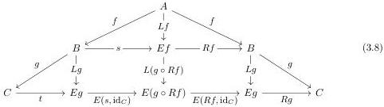
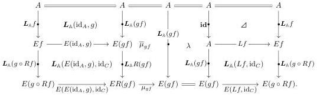

have a diagram

where the upper vertical map lifts to  \( L_{A}f \in A^{\sharp} \)  and the inner rectangle lifts to a retract diagram

\[
\boldsymbol {L} _ {\mathbb {A}} g \xrightarrow {\boldsymbol {L} _ {\mathbb {A}} (s , \mathrm{id} _ {C})} \boldsymbol {L} _ {\mathbb {A}} (g \circ R f) \xrightarrow {\boldsymbol {L} _ {\mathbb {A}} (R f , \mathrm{id} _ {C})} \boldsymbol {L} _ {\mathbb {A}} g
\]

in \(\mathbb{A}^{\sharp}\). It follows by compositionality of the codomain retract lifting operator that \(jg \star jf\) is isomorphic to the lift of \(L_{\mathbb{A}}(g \circ Rf) \star L_{\mathbb{A}}f\) along the codomain retract \(gf \to L(g \circ Rf) \circ Lf \to gf\) displayed above. Now, recalling the transformation \(\overline{\mu}\) provided by Proposition 3.5.7, we consider the composite \(L_{\mathbb{A}}(g \circ Rf) \star L_{\mathbb{A}}f \to L_{\mathbb{A}}(gf) \to L_{\mathbb{A}}(g \circ Rf) \star L_{\mathbb{A}}f\) given by the diagram

Although this is not itself a retract diagram, post-composing the bottom horizontal row with \( Rg \circ E(Rf, \mathrm{id}_C) \colon E(g \circ Rf) \to C \) yields

\[
\begin{array}{l} R g \circ E (f, \mathrm{id} _ {C}) \circ \mu_ {g f} \circ E (E (\mathrm{id} _ {A}, g), \mathrm{id} _ {C}) = R (g f) \circ \mu_ {g f} \circ E (E (\mathrm{id} _ {A}, g), \mathrm{id} _ {C}) \\ = R R (g f) \circ E (E (\mathrm{id} _ {A}, g), \mathrm{id} _ {C}) \\ = R (g \circ R f) \\ = R g \circ E (R f, \mathrm{id} _ {C}). \\ \end{array}
\]

Thus a second application of compositionality (with a trivial top retract) implies that the lift of  \( \boldsymbol{L}_{\mathbb{A}}(g \circ Rf) \star \boldsymbol{L}_{\mathbb{A}}f \)  along (3.8) is isomorphic to the lift of  \( \boldsymbol{L}_{\mathbb{A}}(gf) \)  along the composite retract  \( gf \to L(g \circ Rf) \circ Lf \to L(gf) \to L(g \circ Rf) \circ Lf \to gf \) , which is by definition  \( j(\boldsymbol{g} \star \boldsymbol{f}) \) . ☐

## 4 Applications

### 4.1 Uniform box-filling fibrations

To apply the theorems of Section 3.5 effectively, we must be able to compute the density comonads of generating diagrams. We illustrate how this proceeds using the example of AWFS's for uniform fibrations, which appear in semantics of homotopy type theory [GS17]. For simplicity we consider only "biased" uniform fibrations, in Awodey's terminology [Awo23, §3], and not unbiased or equivariant variations which are better-behaved in some settings [CMS20; Awo23; ACCRS24].

40