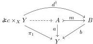

**Notation 4.1.13.** Given a presheaf category $\mathcal{E}$, write $\mathcal{M}_{\mathrm{lc}} \hookrightarrow \mathcal{E}$ for its wide subcategory of levelwise complemented monomorphisms. Write $\mathcal{E}_{\mathrm{cart}}^{\rightarrow} \hookrightarrow \mathcal{E}^{\rightarrow}$ for the wide subcategory of pullback squares, $\mathcal{E}_{\mathrm{cart}}^{\rightarrow} \hookrightarrow \mathcal{E}_{\mathrm{cart}}^{\rightarrow}$ for its full subcategory whose objects are the monomorphisms in $\mathcal{E}$, and $\mathcal{E}_{\mathrm{cart}}^{\mathrm{lc}\rightarrow} \hookrightarrow \mathcal{E}_{\mathrm{cart}}^{\mathrm{lc}\rightarrow}$ for the further full subcategory of maps in $\mathcal{M}_{\mathrm{lc}}$.

**Lemma 4.1.14.** If $f: Y \rightarrow X$ is a locally finite morphism in $\mathcal{E} = \mathrm{PSh}(\mathcal{C})$, then the functorial action of the pushforward $f_*: \mathcal{E}/Y \rightarrow \mathcal{E}/X$ (that is, the right adjoint to pullback) preserves $\mathcal{M}_{\mathrm{lc}} \hookrightarrow \mathcal{E}$.

*Proof.* A monomorphism $m: A \mapsto B$ is in $\mathcal{M}_{\mathrm{lc}}$ if and only if for every $d: \not\perp c \rightarrow B$, we can decide whether $d$ lifts through $m$. Let $m: (A, a) \mapsto (B, b)$ be a morphism in $\mathcal{E}/Y$ whose underlying morphism is in $\mathcal{M}_{\mathrm{lc}}$ and write $f_*m: \prod_f A \mapsto \prod_f B$ for the morphism in $\mathcal{E}$ underlying its pushforward along $f$. For $d: \not\perp c \rightarrow \prod_f B$, we see by transposition that $d$ lifts through $f_*m$ if and only if we have a lift as indicated in the diagram

*i.e.*, if and only if $d^\dagger: \not\perp \times_X Y \rightarrow B$ lifts through $m$. The object $\not\perp c \times_X Y$ is the domain of $u^f(d)$, thus a finite colimit of representables by assumption. If $(v_i: \not\perp c_i \rightarrow \not\perp c \times_X Y)_{i \in I}$ is the colimit cocone, then $d^\dagger$ lifts through $m$ if and only if $d^\dagger v_i: \not\perp c_i \rightarrow Y$ lifts through $m$ for all $i \in I$, and this we can decide by assumption. $\square$

**Lemma 4.1.15.** Let $(t, I)$ be a uniform fibration configuration in a presheaf category $\mathcal{E}$. The density comonad $\mathrm{D}_{u^\dagger}: \mathcal{E}^\rightarrow \rightarrow \mathcal{E}^\rightarrow$ lifts through $\mathcal{E}_{\mathrm{cart}}^{\rightarrow} \hookrightarrow \mathcal{E}^\rightarrow$ and preserves monomorphisms. If $(t, I)$ is finitary, then the density comonad furthermore lifts through $\mathcal{E}_{\mathrm{cart}}^{\mathrm{lc}\rightarrow} \hookrightarrow \mathcal{E}^\rightarrow$ and preserves $\mathcal{E}^\rightarrow (\frac{\mathcal{M}_{\mathrm{lc}}}{\mathcal{M}_{\mathrm{lc}}})$.

*Proof.* By Corollary 4.1.10 we have $\mathrm{D}_{u^\dagger} \cong \phi^\dagger \nu^\dagger$. The functor $\phi^\dagger$ sends all morphisms in $\mathcal{E}/\mathbb{F}$ to cartesian squares by pullback pasting, so $\phi^\dagger$ and thus $\mathrm{D}_{u^\dagger}$ lifts through $\mathcal{E}_{\mathrm{cart}}^{\rightarrow} \hookrightarrow \mathcal{E}^\rightarrow$. Likewise, $\phi^\dagger$ is valued in monomorphisms and in $\mathcal{E}_{\mathrm{cart}}^{\mathrm{lc}\rightarrow}$ if $(t, I)$ is finitary, so $\mathrm{D}_{u^\dagger}$ lifts through $\mathcal{E}_{\mathrm{cart}}^{\rightarrow} \hookrightarrow \mathcal{E}^\rightarrow$ and through $\mathcal{E}_{\mathrm{cart}}^{\mathrm{lc}\rightarrow} \hookrightarrow \mathcal{E}^\rightarrow$ if $(t, I)$ is finitary.

We know $\nu^\dagger$ preserves monomorphisms as a right adjoint, and $\phi^\dagger$ preserves monomorphisms by cancellation, so $\mathrm{D}_{u^\dagger}$ preserves monomorphisms. Suppose $(t, I)$ is finitary. Inspecting the decompositions of $\phi^\dagger$ and $\nu^\dagger$ in Notation 4.1.8, we can see that $\mathrm{D}_{u^\dagger}$ will preserve $\mathcal{E}^\rightarrow (\frac{\mathcal{M}_{\mathrm{lc}}}{\mathcal{M}_{\mathrm{lc}}})$ as long as the action of $(t, \mathrm{id}_{\mathbb{F}})_*: \mathcal{E}^\rightarrow / t \rightarrow \mathcal{E}^\rightarrow / \mathrm{id}_{\mathbb{F}}$ preserves $\mathcal{E}^\rightarrow (\frac{\mathcal{M}_{\mathrm{lc}}}{\mathcal{M}_{\mathrm{lc}}})$. This follows from Lemma 4.1.14 applied with the presheaf category $\mathcal{E}^\rightarrow \simeq \mathrm{PSh}(\mathcal{C}^\rightarrow)$ and the morphism $(t, \mathrm{id}_{\mathbb{F}}): t \rightarrow \mathrm{id}_{\mathbb{F}}$, which is locally finite if $t$ is. $\square$

**Corollary 4.1.16.** For any uniform fibration configuration $(t, I)$ on a presheaf category $\mathcal{E}$, if the monomorphisms form a $\kappa$-backdrop (Example 2.3.3) then the diagram $\mathsf{box}_I^\dagger$ is compatible with this backdrop. If $(t, I)$ is finitary, then $\mathsf{box}_I^\dagger$ is compatible with the backdrop of levelwise complemented monomorphisms (Example 2.3.4).

*Proof.* For the first claim, it suffices by Proposition 3.2.6 to check that $\mathrm{D}_{\mathsf{box}_I^\dagger}$ lifts through $\mathcal{E}_{\mathrm{cart}}^{\rightarrow} \hookrightarrow \mathcal{E}^\rightarrow$ and preserves levelwise monomorphisms. By Lemma 4.1.15 and Corollary 4.1.12, it suffices in turn to show that each $\hat{\delta}^i: \mathcal{E}^\rightarrow \rightarrow \mathcal{E}^\rightarrow$ restricts to a functor $\mathcal{E}_{\mathrm{cart}}^{\rightarrow} \rightarrow \mathcal{E}_{\mathrm{cart}}^{\rightarrow}$ and that this restriction preserves monomorphisms; note that the functors $\hat{\partial}_i$ are right adjoints and thus automatically preserve monomorphisms.

44