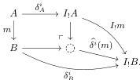
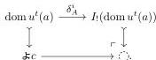

For $i \in \{0, 1\}$ and a monomorphism $m \colon A \to B$ in $\mathcal{E}$, $\widehat{\delta^i}(f)$ is defined as the pushout gap map

Combined with the assumptions that $\delta^i$ is cartesian and that $I_!$ preserves pullbacks and thus monomorphisms, this makes $\widehat{\delta^i}(m)$ the union of the monomorphisms $\delta_B^i$ and $I_!m$ [LS05, Theorem 5.1] and thus a monomorphism.

For any $f \colon B' \to B$, $\widehat{\delta^i}$ applied to the pullback of $m$ along $f$ is the pullback of $\widehat{\delta^i}(m)$ along $I_!f$, by pullback stability of colimits in $\mathcal{E}$ together with the assumptions that $I_!$ preserves pullbacks and $\delta_i$ is cartesian. Thus $\widehat{\delta^i}$ lifts to a functor $\mathcal{E}_{\text{cart}}^{\leftrightarrow} \to \mathcal{E}_{\text{cart}}^{\leftrightarrow}$.

Given a levelwise monomorphism $(k, \ell) \colon m \to n$ in $\mathcal{E}_{\text{cart}}^{\leftrightarrow}$, the codomain component of $\widehat{\delta^i}(k, \ell)$ is a monomorphism because $I_!$ preserves monomorphisms, whence the domain component is a monomorphism by cancellation.

We now assume $(t, I)$ is finitary and check the second claim. It suffices by Proposition 3.2.6 to check that $D_{\text{box}_I}$ lifts through $\mathcal{E}_{\text{cart}}^{\text{lc}\leftrightarrow} \hookrightarrow \mathcal{E}^\rightarrow$ and preserves $\mathcal{E}^\rightarrow (\frac{\mathcal{M}_{\text{lc}}}{\mathcal{M}_{\text{lc}}})$. The first property follows from the assumptions that $\delta^i$ is valued in and $I_!$ preserves $\mathcal{M}_{\text{lc}}$ and the closure of levelwise complemented monomorphisms under binary union [GSS22, Lemma 2.1.7(i)]. For the second, we first observe that $\widetilde{\partial}_i$ preserves $\mathcal{E}^\rightarrow (\frac{\mathcal{M}_{\text{lc}}}{\mathcal{M}_{\text{lc}}})$ because $I^*$ preserves $\mathcal{M}_{\text{lc}}$ and complemented monomorphisms are closed under finite limits [GSS22, Lemma 2.1.7(ii)]. Thus it is enough, as in the monomorphism case, to check that the restriction of $\widehat{\delta^i}$ to $\mathcal{E}_{\text{cart}}^{\text{lc}\leftrightarrow}$ preserves $\mathcal{E}^\rightarrow (\frac{\mathcal{M}_{\text{lc}}}{\mathcal{M}_{\text{lc}}})$, and this follows from cancellation for levelwise complemented monomorphisms. $\square$

**Theorem 4.1.17.** Let $(t, I)$ be a uniform fibration configuration in a presheaf category $\mathcal{E} = \text{PSh}(\mathcal{C})$. If either (a) the monomorphisms form a $\kappa$-backdrop in $\mathcal{E}$ and $t$ is locally $(\kappa, \text{mono})$-small, or (b) $(t, I)$ is finitary, then the uniform fibration AWFS on $(t, I)$ exists.

*Proof.* By Theorem 3.2.12 applied either with the $\kappa$-backdrop of monomorphisms or with the $\omega$-backdrop $\mathcal{M}_{\text{lc}}$ and with the diagram $\text{box}_I^t$, which is suitable by Corollary 4.1.16. For $i \in \{0, 1\}$ and $a \colon \mathfrak{A}c \to \mathbb{F}$, the domain of $\widehat{\delta^i}u^t(a)$ is the pushout

Since $(\kappa, \mathcal{M})$-small objects are closed under finite colimits, the smallness condition on $\text{box}_I^t$ is thus satisfied in each case. $\square$

In the following sections, we use uniform fibration AWFS's to illustrate applications of the theorems of Section 3.5. To avoid becoming repetitive we focus on the case where $(t, I)$ is finitary.

## 4.2 Action of a functor on left maps

Suppose we have a functor $F \colon \mathcal{E} \to \mathcal{F}$ and a WFS $(\mathcal{L}, \mathcal{R})$ on $\mathcal{E}$ generated by a set $S$ using Quillen's small object argument, and we want to show that $F$ sends $\mathcal{L}$ into some saturated class of maps $\mathcal{A}$—perhaps the left class of another WFS on $\mathcal{F}$. The saturation characterization of $\mathcal{L}$ tells us that if $F$ preserves cell complex structure, then it is enough to check that $F$ sends $S$ into $\mathcal{A}$. For our first application, we prove an analogue of this result for AWFS's cofibrantly generated by a diagram.

45