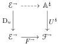
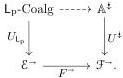

Definition 4.2.1. Let \( F \colon \mathcal{E} \to \mathcal{F} \) be a functor and \( U \colon \mathbb{A} \to \mathbb{S}\mathrm{q}(\mathcal{F}) \) be a notion of composable structure. We define the notion of composable structure \( F^{*}U \colon F^{*}\mathbb{A} \to \mathbb{S}\mathrm{q}(\mathcal{E}) \) by pulling back along \( F \):

\[
\begin{array}{c} (F ^ {*} \mathbb {A}) ^ {\ddagger} \xrightarrow {} \mathbb {A} ^ {\ddagger} \\ (F ^ {*} U) ^ {\ddagger} \Biggl \downarrow \quad \Biggl \downarrow U ^ {\ddagger} \\ \mathcal {E} ^ {\rightarrow} \xrightarrow [ F ^ {\rightarrow} ]{} \mathcal {F} ^ {\rightarrow}. \end{array} \tag {4.1}
\]

That is, a vertical morphism \( A \leftrightarrow B \) in \( F^{*}\mathbb{A} \) consists of a morphism \( f\colon A \to B \) in \( \mathbb{D} \) together with a vertical morphism \( g\colon FA \leftrightarrow FB \) in \( \mathbb{A} \) such that \( Ug = Ff \). Likewise, a square in \( F^{*}\mathbb{A} \) consists of a commutative square in \( \mathcal{E} \) together with a square of \( \mathbb{A} \) over its image by \( F \). Identities and composition are given in the evident way. The diagram (4.1) extends to a double functor

\[
\begin{array}{c} F ^ {*} \mathbb {A} \xrightarrow {} \mathbb {A} \\ F ^ {*} U \Big \downarrow^ {\lrcorner} \qquad \qquad \qquad \qquad \qquad \qquad \Big \downarrow U \\ \operatorname{Sq} (\mathcal {E}) \xrightarrow [ \operatorname{Sq} (F) ]{} \operatorname{Sq} (\mathcal {F}). \end{array}
\]

Proposition 4.2.2. Let \( U \colon \mathbb{A} \to \mathbb{S}\mathrm{q}(\mathcal{F}) \) be a notion of composable structure and \( F \colon \mathcal{E} \to \mathcal{F} \) be a functor. If \( U \) is left-connected, then so is \( F^{*}U \).

Proposition 4.2.3. Let \( U \colon \mathbb{A} \to \mathbb{S}\mathrm{q}(\mathcal{F}) \) be a notion of composable structure and \( F \colon (\mathcal{E},\mathcal{M}) \to (\mathcal{F},\mathcal{N}) \) be a \( \kappa \)-backdrop-preserving functor. If \( U \) is \( (\kappa, \mathcal{N}) \)-cellular, then \( F^{*}U \colon F^{*}\mathbb{A} \to \mathbb{S}\mathrm{q}(\mathcal{E}) \) is \( (\kappa, \mathcal{M}) \)-cellular.

Proof. The projections from \((F^{*}\mathbb{A})^{\ddagger}\) to \(\mathcal{E}^{\rightarrow}\) and \(\mathbb{A}^{\ddagger}\) send \((F^{*}\mathbb{A})^{\ddagger}(\frac{\approx}{\mathcal{M}})\) into \(\mathcal{E}^{\rightarrow}(\frac{\approx}{\mathcal{M}})\) and \(\mathbb{A}^{\ddagger}(\frac{\approx}{\mathcal{N}})\) respectively, and the cospan of the defining pullback (4.1) extends to a diagram of \(\kappa\)-backdrop-preserving functors

\[
\begin{array}{c} (\mathbb {A} ^ {\ddagger}, \mathbb {A} ^ {\ddagger} (\frac {\approx}{\mathcal {N}})) \\ \Big \downarrow_ {U ^ {\ddagger}} \\ (\mathcal {E} ^ {\rightarrow}, \mathcal {E} ^ {\rightarrow} (\frac {\approx}{\mathcal {M}})) \xrightarrow [ F ^ {\rightarrow} ]{} (\mathcal {F} ^ {\rightarrow}, \mathcal {F} ^ {\rightarrow} (\frac {\approx}{\mathcal {N}})). \end{array}
\]

It follows that the relevant colimits in \((F^{*}\mathbb{A})^{\ddagger}\) can be computed levelwise and that the pullback projection \((F^{*}U)^{\ddagger}\) preserves them, as required.

Proposition 4.2.4. Let \( F \colon \mathcal{E} \to \mathcal{F} \) be a functor and \( U \colon \mathbb{A} \to \mathbb{S}\mathrm{q}(\mathcal{F}) \) be a notion of composable structure. Any (compositional) codomain retract lifting operator on \( U \) induces a (compositional) codomain retract lifting operator on \( F^{*}U \).

We now deduce the following generalization of Theorems 3.5.13 and 3.5.16.

Theorem 4.2.5. Fix a \(\kappa\)-backdrop-preserving functor \(F\colon (\mathcal{E},\mathcal{M})\to (\mathcal{F},\mathcal{N})\) and diagram \(u\colon \mathcal{J}\to \mathcal{E}^{\rightarrow}\) compatible with \(\mathcal{M}\) such that \(\operatorname {dom}u\) is levelwise \((\kappa ,\mathcal{M})\)-small. Write \((\mathsf{L},\mathsf{R})\) for the AWFS cofibrantly generated by \(u\). For a left-connected, \((\kappa ,\mathcal{N})\)-cellular notion of composable structure \(U\colon \mathbb{A}\to \mathbb{S}\mathrm{q}(\mathcal{F})\) with a codomain retract lifting operator, any lift

induces a functor

If \(\mathbb{A}\) is thin and its codomain retract lifting operator is compositional, then said functor extends to a pseudo double functor \(\mathsf{L}_{\mathrm{p}}\)-Coalg \(\to \mathbb{A}\) over \(\mathbb{S}\mathrm{q}(\mathcal{E}) \to \mathbb{S}\mathrm{q}(\mathcal{F})\).

46