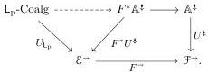

Proof. We apply Theorem 3.5.13 with the $\kappa$-backdrop $\mathcal{M}$ and the notion of composable structure

$$F^*U \colon F^*\mathbb{A} \to \operatorname{Sq}(\mathcal{E}),$$

which is $(\kappa, \mathcal{M})$-cellular by Propositions 3.3.8 and 4.2.3 and admits retract lifting by Proposition 4.2.4. We obtain a pseudo double functor

The top horizontal composite is the desired functor $j \colon \mathrm{L_p-Coalg} \to \mathbb{A}^\natural$. When $\mathbb{A}$ is thin and its codomain retract lifting operator is compositional, we can instead apply Theorem 3.5.16 to get a pseudo double functor.

Remark 4.2.6. Note that the analogous theorem for Quillen's small object argument only requires $F$ to preserve cobase changes and transfinite composites of maps in the left class, whereas our theorem requires this for the larger class $\mathcal{M}$. It is not clear to us whether the stronger result can be derived from ours when the generating diagram is discrete.

A typical application is to show that that a backdrop-preserving functor sends the left maps of one AWFS to left maps of another AWFS. In the specific case of a uniform fibration AWFS, the density comonad condition reduces to a natural requirement on pushout applications of the endpoints $\delta_i$ to cofibrations:

Example 4.2.7. Let $(t, I)$ be a finitary uniform fibration configuration in a presheaf category $\mathcal{E} = \mathrm{PSh}(\mathcal{C})$. Let $(\mathsf{L}, \mathsf{R})$ be an AWFS on a category $\mathcal{F}$ and let $F \colon (\mathcal{E}, \mathcal{M}_{\mathrm{lc}}) \to (\mathcal{F}, \mathcal{N})$ be an $\omega$-backdrop-preserving functor. If $F\hat{\delta}_i\phi^i \colon \mathcal{E}/\mathbb{F} \to \mathcal{F}^-$ lifts through $\mathrm{L_p-Coalg}$ for $i \in \{0, 1\}$, then $\operatorname{Sq}(F) \colon \operatorname{Sq}(\mathcal{E}) \to \operatorname{Sq}(\mathcal{F})$ lifts to a double functor $\mathrm{TCof_p}(t, I) \to \mathrm{L_p-Coalg}$.

Proof. The notion of composable structure $\mathrm{L_p-Coalg}$ with the backdrop $\mathcal{N}$ satisfies the requirements of Theorem 4.2.5 by Proposition 3.3.8 and Example 3.5.15. The result follows using Corollaries 4.1.12 and 4.1.16. Note that the pseudo double functor we obtain is necessarily a double functor because $U_{\mathrm{L_p}}^\natural$ is amnestic, i.e., any isomorphism it sends to an identity is itself an identity.

Example 4.2.8. In work currently in progress, we use Example 4.2.7 to analyze exponentiation by quotients of representables in cubical set categories. We briefly sketch the situation here, using the Boolean cubical sets from Example 4.1.6.

For this form of cubical set, we have an isomorphism $\sigma \colon \mathbb{I} \cong \mathbb{I}$ that swaps 0 and 1. Exponentiation by the quotient $\mathbb{I}/\sigma$ in $\mathrm{PSh}(\mathcal{C})$ defines a functor $(-)^{\mathbb{I}/\sigma} \colon \mathrm{PSh}(\mathcal{C}) \to \mathrm{PSh}(\mathcal{C})$ that does not preserve all colimits, but turns out to preserve colimits of $\omega$-chains and pushouts along monomorphisms. It moreover preserves $\mathbb{I}$: the inclusion of constant maps $\mathbb{I} \to \mathbb{I}^{\mathbb{I}/\sigma}$ is an isomorphism. It follows from Example 4.2.7 that $(-)^{\mathbb{I}/\sigma}$ preserves the trivial cofibrations of any finitary uniform fibration configuration for which $(-)^{\mathbb{I}}$ (and thus $(-)^{\mathbb{I}/\sigma}$) preserves cofibrations. Ken Brown's lemma [Hov99, Lemma 1.1.12] then implies that $(-)^{\mathbb{I}/\sigma}$ preserves weak equivalences between cofibrant objects.

This implies that the model structure mentioned in Example 4.1.6 does not coincide, in classical set theory, with Cisinski's test model structure on this presheaf category [Cis06; BM17]. Indeed, the object $\mathbb{I}/\sigma$ is contractible in the test model structure but cannot be contractible in the uniform fibration model structure: the argument above would then imply that $(\mathbb{I}/\sigma)^{\mathbb{I}/\sigma}$ is also contractible, but $(\mathbb{I}/\sigma)^{\mathbb{I}/\sigma}$ is isomorphic to $1 \sqcup \mathbb{I}/\sigma$ and thus patently non-contractible.

In the case of cartesian cubical sets, an unpublished note of Coquand [Coq18] describes an argument by the second author that the quotient of the 2-cube by the reflection along its diagonal is not contractible in a uniform fibration model structure, using an explicit inductive description of the (trivial cofibration, fibration) factorization for that model structure. Our saturation principle abstracts the inductive process involved in this argument.

47