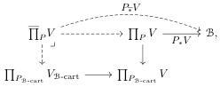
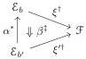

We will also need an analogue of the concept of Van Kampen colimit [LS04; CG07; HS11] in the setting of a Grothendieck fibration.

Definition 4.3.4. Let \( P \colon \mathcal{E} \to \mathcal{B} \) be a Grothendieck fibration. We say that a colimit cocone \( \beta \colon b \to \Delta b_0 \) under a diagram \( b \colon \mathcal{K} \to \mathcal{B} \) is Van Kampen for \( P \) when

(a) every \(e\colon \mathcal{K}\to \mathcal{E}_{\mathcal{B}\text{-cart}}\) over \(b\) admits a colimit cocone in \(\mathcal{E}_{\mathcal{B}\text{-cart}}\) over \(\beta\);
(b) given \(e\colon \mathcal{K}\to \mathcal{E}_{\mathcal{B}\text{-cart}}\) , every cocone \(\eta \colon e\to \Delta e_0\) in \(\mathcal{E}_{\mathcal{B}\text{-cart}}\) over \(\beta\) is a colimit cocone in \(\mathcal{E}\)

Remark 4.3.5. The cocone \(\beta\) is Van Kampen for \(P\) exactly if the corresponding pseudofunctor \(\mathcal{E}_{(-)}\colon \mathcal{B}^{\mathrm{op}}\to \mathbf{Cat}\) sends it to a bilimit of categories.

A Van Kampen colimit in the usual sense in a category \(\mathcal{E}\) with pullbacks is then a colimit which is Van Kampen for the codomain fibration \(\mathrm{cod}\colon \mathcal{E}^{-}\to \mathcal{E}\).

#### 4.3.1 Cartesian pushforwards

We want to associate left maps with operations that take a structure on the domain as input and output an extension to the codomain. To define a category of such operations, we make use of pushforwards in Cat. Recall that a functor \( P \colon \mathcal{E} \to \mathcal{B} \) is called exponentiable if the pullback functor \( P^* \colon \mathbf{Cat} / \mathcal{B} \to \mathbf{Cat} / \mathcal{E} \) has a right adjoint \( P_* \), and that any Grothendieck fibration is exponentiable [Gir64, Lemme 4.3, Théorème 4.4]. Given \( F \colon \mathcal{F} \to \mathcal{E} \), we write \( P_*F \colon \prod_P F \to \mathcal{B} \) for the application of the right adjoint and call this the pushforward of \( F \) along \( P \).

In fact we want a variation on the pushforward with a stronger condition on morphisms.

Definition 4.3.6. Let \( P \colon \mathcal{E} \to \mathcal{B} \) and \( Q \colon \mathcal{F} \to \mathcal{B} \) be Grothendieck fibrations and \( V \colon (\mathcal{F}, Q) \to (\mathcal{E}, P) \) be a fibered functor over \( \mathcal{E} \). The cartesian pushforward \( P_{\mathbb{F}}V \colon \overline{\prod}_{P}V \to \mathcal{B} \) is the pullback

where  \( V_{B-cart} \colon P_{B-cart} \to Q_{B-cart} \)  is the restriction of V to cartesian arrows over B.

The objects \(\xi \in \prod_{P} V\) over \(b \in \mathcal{B}\) correspond, by transposition, to sections \(\xi^{\dagger} \colon \mathcal{E}_b \to \mathcal{F}_b\) of the restriction \(V_b \colon \mathcal{F}_b \to \mathcal{E}_b\) of \(V\) to the fibers over \(b\). The category \(\overline{\prod}_{P} V\) has the same objects: they are sections \(\mathcal{E}_b \to \mathcal{F}_b\) which preserve cartesian morphisms over \(\mathcal{B}\), but this is no requirement since any vertical cartesian morphism is an isomorphism. Its morphisms are however more restrictive than those of \(\prod_{P} V\), as we now unpack.

Proposition 4.3.7. Let \( P \colon \mathcal{E} \to \mathcal{B} \) and \( V \colon \mathcal{F} \to \mathcal{E} \) be a functor. Given a morphism \( \alpha \colon b \to b' \) in \( \mathcal{B} \) and objects \( \xi \in (\prod_P V)_b \) and \( \xi' \in (\prod_P V)_{b'} \), the morphisms \( \beta \colon \xi \to \xi' \) in \( \prod_P V \) over \( \alpha \) correspond to natural transformations

such that  \( V\beta_{e}^{\ddagger}=\overline{\alpha}e:\alpha^{*}e\to e \)  for  \( e\in E_{b'} \) .

Proof. Use the universal property of \( P_*V \) to characterize the functors \( 2 \to \prod_P V \).

□

49