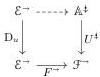
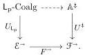
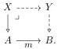

fibrations, which are used in the semantics of homotopy type theory [GS17]. We show here how the density comonad for a given diagram of generators can be calculated in practice. Fixing a notion of configuration for a uniform fibration AWFS (Definition 4.1.1), we use Theorem 3.2.12 to prove:

Theorem 4.1.17. Let \((t, I)\) be a uniform fibration configuration in a presheaf category \(\mathcal{E} = \mathrm{PSh}(\mathcal{C})\). If either (a) the monomorphisms form a \(\kappa\)-backdrop in \(\mathcal{E}\) and \(t\) is locally \((\kappa, \text{mono})\)-small, or (b) \((t, I)\) is finitary, then the uniform fibration AWFS on \((t, I)\) exists.

The first condition (a) is always satisfied in classical set theory with choice. In the field of semantics of homotopy type theory, there is an interest in obtaining such AWFS's constructively; condition (b) (Definition 4.1.5) offers a route for a more limited class of configurations that can be applied in constructive metatheories, even those without general quotients. This is made possible by our refinement of the algebraic small object argument to non-cocomplete settings. For the interested reader, we comment on the constructivity of our results in Appendix A.

Our first application is a relativization of Theorems 3.5.13 and 3.5.16:

Theorem 4.2.5. Fix a \(\kappa\)-backdrop-preserving functor \(F\colon (\mathcal{E},\mathcal{M})\to (\mathcal{F},\mathcal{N})\) and diagram \(u\colon \mathcal{J}\to \mathcal{E}^{-}\) compatible with \(\mathcal{M}\) such that \(\operatorname {dom}u\) is levelwise \((\kappa ,\mathcal{M})\)-small. Write \((\mathsf{L},\mathsf{R})\) for the AWFS cofibrantly generated by \(u\). For a left-connected, \((\kappa ,\mathcal{N})\)-cellular notion of composable structure \(U\colon \mathbb{A}\to \mathbb{S}\mathrm{q}(\mathcal{F})\) with a codomain retract lifting operator, any lift

induces a functor

If \(\mathbb{A}\) is thin and its codomain retract lifting operator is compositional, then said functor extends to a pseudo double functor \(\mathsf{L}_{\mathrm{p}}\)-Coalg \(\to \mathbb{A}\) over \(\mathbb{S}\mathrm{q}(\mathcal{E}) \to \mathbb{S}\mathrm{q}(\mathcal{F})\).

This corresponds to a typical use of the classical saturation principle, namely showing that a functor \( F \colon \mathcal{E} \to \mathcal{F} \) sends left maps in \( \mathcal{E} \) into some class of maps in \( \mathcal{F} \). Often \( U \colon \mathbb{A} \to \mathbb{S}\mathrm{q}(\mathcal{F}) \) is the double category of left maps for a second AWFS on \( \mathcal{F} \); such a double category always satisfies the left-connectedness and cellularity hypotheses.

For our second application, we look at extension operations, operations that take some structure on the domain of a left map and extend it to the codomain. Concretely, we are interested in showing that certain Quillen premodel categories [Bar19] satisfy the fibration extension property, the property that any fibration  \( X \rightharpoonup A \)  can be extended along any trivial cofibration  \( A \rightharpoonup B \)  to produce a fibration over B fitting in a pullback square

This property can be used to show that a premodel category is in fact a Quillen model category (see, e.g., [CS25, §3.3]). We consider more generally a category \(\mathcal{E}\) equipped with a Grothendieck fibration \(P\colon \mathcal{F}\to \mathcal{E}\); for the motivating example, the fiber of \(P\) at \(A\in \mathcal{E}\) is the category of fibrations into \(A\). Given \(P\), we define a notion of composable structure \(U_{P}\colon \mathrm{Ext}_{P}\to \mathcal{E}^{-}\) (Definition 4.3.14) for which a structure on a morphism \(m\colon A\to B\) is a section of the reindexing functor \(m^{*}\colon \mathcal{F}_{B}\to \mathcal{F}_{A}\), then use Theorem 3.5.13 to show:

Theorem 4.3.19. Let \(\mathcal{E}\) be a category with a \(\kappa\)-backdrop \(\mathcal{M}\) and a diagram \(u\colon \mathcal{J}\to \mathcal{E}^{-}\) compatible with \(\mathcal{M}\) such that \(\operatorname {dom}u\) is levelwise \((\kappa ,\mathcal{M})\)-small. Write \((\mathsf{L},\mathsf{R})\) for the AWFS cofibrantly generated by \(u\). Let \(P\colon \mathcal{F}\to \mathcal{E}\) be a Grothendieck fibration such that

5