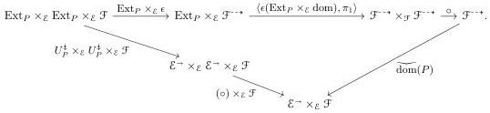

and vertical composition \(\star\): \(\mathrm{Ext}_P \times_{\mathcal{E}} \mathrm{Ext}_P \to \mathrm{Ext}_P\) to be the transpose of the diagram

Conservativity of  \( U_{P}^{\ddagger} \)  follows from the description of morphisms in Ext \( _{P} \)  in Corollary 4.3.8.

Proposition 4.3.15. \(U_{P}\colon \mathbb{Ext}_{P}\to \mathbb{Sq}(\mathcal{E})\) is left-connected.

Proof. A square with boundary of the form

\[
\begin{array}{c} A \xrightarrow {h} B \\ \mathrm{id} _ {A} \Big \downarrow \qquad \qquad \qquad \qquad \qquad \qquad \qquad \qquad \qquad \qquad \qquad \qquad \qquad \qquad \qquad \qquad \qquad \qquad \qquad \qquad \qquad \qquad \qquad \qquad \qquad \qquad \qquad \qquad \qquad \qquad \qquad \qquad \qquad \qquad \\ A \xrightarrow [ k ]{} C \end{array}
\]

in \(\mathbb{Ext}_P\) consists by Corollary 4.3.8 of a natural isomorphism \(\theta\) such that

\[
\begin{array}{c c c c} \mathcal {F} _ {A} \xrightarrow {\mathrm{id} _ {(-)}} \mathcal {F} _ {\mathrm{id} _ {A}} ^ {- *} \xrightarrow {\mathrm{dom}} \mathcal {F} _ {A} & & \mathcal {F} _ {A} = \mathcal {F} _ {A} \\ h ^ {*} \Bigg | _ {\mathcal {F} _ {B}} \xrightarrow [ g ^ {\dagger} ]{\theta} (h, k) ^ {*} \cong \Bigg | _ {\mathcal {F} _ {B}} \xrightarrow [ g ^ {\dagger} ]{\uparrow} \mathcal {F} _ {g} ^ {- *} \xrightarrow [ \mathrm{dom} ]{\uparrow} \mathcal {F} _ {B} & = & h ^ {*} \Bigg | _ {\mathcal {F} _ {B}} \xrightarrow [ g ^ {\dagger} ]{\uparrow} \mathcal {F} _ {B}. \end{array}
\]

Because any vertical cartesian morphism is an isomorphism, any pair of objects of  \( F_{id_{A}}^{-*} \)  are related by a unique domain-fixing isomorphism. Thus there is a unique such square provided gh = k. ☐

Proposition 4.3.16. \(U_{P}\colon \mathbb{Ext}_{P}\to \mathbb{Sq}(\mathcal{E})\) admits a codomain retract lifting operator.

Proof. Suppose we have a codomain retract diagram

\[
\begin{array}{c} A \\ \Big \downarrow f \\ B ^ {\prime} \xrightarrow [ s ]{} B \xrightarrow [ r ]{} B ^ {\prime} \end{array}
\]

and a vertical morphism over \( f \), which is to say a section \( \xi \colon \mathcal{F}_A \to \mathcal{F}_f^{-*} \) of the domain projection. Post-composing with \( (\mathrm{id}_A, s)^* \colon \mathcal{F}_f^{-*} \to \mathcal{F}_{f'}^{-*} \) yields a vertical morphism over \( f' \). This operation can clearly be made functorial in the retract diagram.

Lemma 4.3.17. Let \( P \colon \mathcal{E} \to \mathcal{B} \) be a Grothendieck fibration, \( F \colon \mathcal{C} \to \mathcal{B} \) be a functor, and \( c \colon \mathcal{K} \to \mathcal{C} \) be a diagram. If \( \psi \colon c \to \Delta c_0 \) is a colimit cocone such that \( F\psi \) is a Van Kampen colimit cocone for \( P \), then \( \psi \) is Van Kampen for \( F^*P \).

Proof. This is a straightforward consequence of the fact that \((\mathcal{C} \times_{\mathcal{B}} \mathcal{E})_{\mathcal{C}\text{-cart}} \cong \mathcal{C} \times_{\mathcal{B}} \mathcal{E}_{\mathcal{B}\text{-cart}}\).

\( ^{5} \) Here we abusively write  \( (\mathrm{id}_{A}, s)^{*} \)  for the functor which performs the canonical lift along s in the codomain and is the identity in the domain, though we have not assumed that  \( id_{A}^{*} \)  is the identity.

52