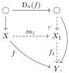

colimit described by the density comonad for \( u \) (1.2):

Here the outer square \(\mathrm{D}_u(f) \to f\) is the counit of the comonad. This is the same construction as Quillen's when \(\mathcal{J}\) is discrete; in the general case, it ensures that the attached solutions satisfy the required coherences (1.1).

Naively iterating this one-step factorization would produce multiple solutions to each problem, and solutions added at different stages would not satisfy the required coherences with respect to each other. One instead iterates while quotienting to identify solutions that are added multiple times. Besides being necessary to handle non-discrete generating diagrams, this change also conceptual benefits: it allows the sequence of approximations to actually converge, and the full construction can be described as applying the algebraically free monad on the pointed endofunctor on \(\mathcal{E}^{\rightarrow}\) that sends \(f\) to its one-step factorization \(f_{1}\). Indeed, the monad \(\mathsf{R}\) of the AWFS \((\mathsf{L},\mathsf{R})\) generated by Garner's argument is precisely this algebraically free monad.

We want to extract a notion of cell complex from this construction. Something has to change: the left factor \( Lf \) of a factorization is still a transfinite composite of step maps, as in Quillen's argument, but now the step maps need not be left maps. The following contrived example illustrates this:

Example 1.2.1. Consider the diagram \( u \colon \mathcal{J} \to \mathbf{Set}^{-} \) where \( \mathcal{J} = \{\mathsf{b} \to \mathsf{a} \leftarrow \mathsf{b}'\} \) is the walking cospan and \( u \) is the mapping

\[
\begin{array}{c c c c} \mathsf {b} & \longrightarrow & \mathsf {a} & \longleftarrow \\ \updownarrow & & \updownarrow & \\ 0 & \longrightarrow & 1 & \longleftarrow \\ \downarrow & & \downarrow^ {v _ {0}} & \\ 1 & \xrightarrow [ v _ {1} ]{} & 1 \sqcup 1 & \xleftarrow [ v _ {1} ]{} \end{array} \tag {1.4}
\]

where  \( v_{0}, v_{1}: 1 \to 1 \sqcup 1 \)  are the two coprojections. This diagram generates the same WFS as the single arrow  \( 0 \to 1 \) , namely the (complemented mono, split epi) WFS on Set.

Now we examine Garner's small object argument applied to factorize \( f \colon 0 \to 1 \). In the first step, we insert solutions to one lifting problem against \( u(\mathsf{b}) \) and one against \( u(\mathsf{b}') \); there are no lifting problems against \( u(\mathsf{a}) \) since the domain of \( f \) is empty. We thus have

\[
\begin{array}{c} 0 \xrightarrow {m _ {1}} 1 \sqcup 1 \\ f \Big \downarrow \qquad \qquad \qquad f _ {1} \Big \downarrow \\ 1 = 1. \end{array}
\]

at the first stage. There are four lifting problems for u against  \( f_{1} \) :

\[
\begin{array}{c} 0 \xrightarrow {!} 1 \sqcup 1 \\ u (\mathsf {b}) \Big \downarrow \qquad \qquad \qquad \Big \downarrow f _ {1} \\ 1 \xrightarrow {!} 1 \end{array}
\]

\[
\begin{array}{c} 0 \xrightarrow {!} 1 \sqcup 1 \\ u (\mathsf {b} ^ {\prime}) \Big \downarrow \qquad \qquad \qquad \Big \downarrow f _ {1} \\ 1 \xrightarrow {!} 1 \end{array}
\]

\[
\begin{array}{c} 1 \xrightarrow {v _ {0}} 1 \sqcup 1 \\ u (\mathsf {a}) \Big \downarrow \qquad \qquad \qquad \Big \downarrow f _ {1} \\ 1 \sqcup 1 \xrightarrow {!} 1 \end{array}
\]

\[
\begin{array}{c} 1 \xrightarrow {v _ {1}} 1 \sqcup 1 \\ u (\mathsf {a}) \Big \downarrow \qquad \qquad \qquad \Big \downarrow f _ {1} \\ 1 \sqcup 1 \xrightarrow {!} 1 \end{array}
\]

7