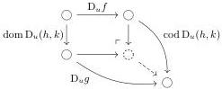

pushout gap map

is in $\mathcal{M}$. The first condition is always satisfied for $\mathcal{M}$ the class of left maps, but the second can fail.

## 2 Fine-grained functoriality of free algebras and monads

The goal of this section is to review free algebra and free monad constructions described by Kelly [Kel80] without the blanket assumption that all small colimits exist. Instead, we make the needed colimits explicit, parametrizing them by a class of maps $\mathcal{M}$ satisfying certain colimit closure properties. We will construct free and algebraically free monads on pointed endofunctors:

Notation 2.0.1. Given a (co)monad $\mathsf{M} = (M, \eta, \mu)$, write $\mathsf{M}_{\mathrm{p}} = (M, \eta)$ for its underlying (co)pointed endofunctor.

Definition 2.0.2. Let $\mathsf{T}$ be a pointed endofunctor on a category $\mathcal{E}$. A monad $\mathsf{M}$ on $\mathcal{E}$ equipped with a morphism of pointed endofunctors $\gamma \colon \mathsf{T} \to \mathsf{M}_{\mathrm{p}}$ on $\mathcal{E}$ defines the free monad on $\mathsf{T}$ when every morphism $\gamma' \colon \mathsf{T} \to \mathsf{M}_{\mathrm{p}}'$ into some monad $\mathsf{M}'$ on $\mathcal{E}$ factors as $\gamma$ followed by a unique morphism of monads on $\mathcal{E}$, and the algebraically free monad on $\mathsf{T}$ when the functor $\mathsf{M}$-Alg $\to \mathsf{T}$-Alg induced by $\gamma$ is an isomorphism of categories.

Besides allowing us to apply the constructions in non-cocomplete settings, an essential consequence is a refined functoriality principle: a translation functor between two settings for the construction (which we call "configurations") need only preserve the class $\mathcal{M}$ and associated colimits for free algebras to be preserved and free monads to be related.

Following Kelly's approach, we first treat well-pointed endofunctors and then reduce the case of an arbitrary pointed endofunctor to the well-pointed case. We parameterize the categories of configurations by a limit ordinal $\kappa$ and impose a convergence condition in terms of the class $\mathcal{M}$. For simplicity of presentation, we prefer to fix $\kappa$ uniformly for all objects, only noting here that a more flexible treatment would be possible. We refer to Remark 2.2.16 below for a comparison with Kelly's convergence criteria.

### 2.1 Strong categories of functors, adjunctions, monads

We express functoriality of the free algebra and free monad constructions by exhibiting functors from a category of configurations to strong (i.e., non-lax) variants of the categories Adj and Mnd of adjunctions and monads, respectively, which we define below.

Definition 2.1.1. The category $\mathbf{Fun}_s$ of functors with strong morphisms is defined as follows:

- (i) An object consists of categories $\mathcal{C}$ and $\mathcal{D}$ with a functor $F \colon \mathcal{C} \to \mathcal{D}$.
- (ii) A morphism $(U, V, \gamma) \colon (\mathcal{C}_1, \mathcal{D}_1, F_1) \to (\mathcal{C}_2, \mathcal{D}_2, F_2)$ consists of functors $U \colon \mathcal{C}_1 \to \mathcal{C}_2$ and $V \colon \mathcal{D}_1 \to \mathcal{D}_2$ with an isomorphism $\gamma \colon VF_1 \cong F_2U$:

$$\begin{array}{c} \mathcal{C}_1 \xrightarrow{U} \mathcal{C}_2 \\ F_1 \Big\downarrow \quad \quad \quad \quad \quad \quad \quad \quad \quad \quad \quad \quad \quad \quad \quad \quad \quad \quad \quad \quad \quad \quad \quad \quad \quad \quad \quad \quad \quad \quad \quad \quad \quad \quad \quad \quad \quad \quad \quad \quad \quad \quad \quad \quad \quad \quad \quad \quad \quad \quad \mathcal{D}_1 \xrightarrow{V} \mathcal{D}_2. \end{array}$$

9