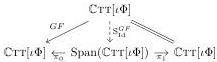
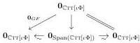

22

Eliminating reversals from cubical type theories

Proof. By Theorem 62, we have an RMC functor fitting in the diagram in \(\mathbb{M}\mathrm{LTT}_{\Sigma ,\mathrm{Id}} / \mathbf{RMC}\) to the left below.

This induces a diagram in  \( \mathbf{Mod}(\mathbb{M}\mathrm{LTT}_{\Sigma,\mathrm{Id}}) \)  as shown to the right, where the morphisms marked  \( \sim \)  are weak equivalences by Proposition 49. By two applications of 2-out-of-3, first in the right triangle and then in the left, it follows that  \( O_{GF} \)  is a weak equivalence.

By the same argument, \(\mathbf{0}_{FG}\colon \mathbf{0}_{\mathbb{C}\mathrm{TT}[\iota \Phi ]}\to \mathbf{0}_{\mathbb{C}\mathrm{TT}[\iota \Phi ]}\) is a weak equivalence. The claim now follows by 2-out-of-6 applied to the string of morphisms \(\mathbf{0}_F\circ \mathbf{0}_G\circ \mathbf{0}_F\)

Theorem 65 (Conservativity of reversals). For every self-dual interval theory \((\Phi, \phi)\), the inclusion \(\mathbb{C}\mathrm{TT}[\iota\Phi] \to \mathbb{C}\mathrm{TT}[\iota\mathrm{Rev}_{\phi}\Phi]\) induces a weak equivalence \(\mathbf{0}_{\mathbb{C}\mathrm{TT}[\iota\Phi]} \to \mathbf{0}_{\mathbb{C}\mathrm{TT}[\iota\mathrm{Rev}_{\phi}\Phi]}\) in \(\mathbf{Mod}(\mathbb{M}\mathrm{LTT}_{\Sigma,\mathrm{Id}})\).

Proof. By Theorem 64 with Theorem 42.

## 7 Interpreting strict cubical type theory with reversals in spaces

Kapulkin and Lumsdaine [22] show that every democratic model  \( \mathcal{M} \in \mathbf{Mod}(\mathbb{M}\mathrm{LTT}_{\Sigma,\mathrm{Id}}) \)  induces a fibration category structure on its category of contexts  \( \mathcal{M}(\star) \) . Such a structure, which is specified by two classes of morphisms in  \( \mathcal{M}(\star) \)  called fibrations and weak equivalences, induces in turn an  \( (\infty,1) \) -category [34] or “homotopy theory”. It is in this way that we judge the kind of higher structure described by a model of  \( M_{LTT_{\Sigma,Id}} \) . The homotopy theory of topological spaces corresponds to one such  \( (\infty,1) \) -category, that of  \( \infty \) -groupoids.

Awodey et al. [6] and Cavallo and Sattler [11] exhibit constructive models \(\mathcal{M}\) of strict cubical type theories without reversals whose induced \((\infty, 1)\)-categories are classically equivalent to the \((\infty, 1)\)-category of \(\infty\)-groupoids. These models are not themselves democratic, so here we mean that their hearts \(\mathcal{M}^{\heartsuit}\) present these \((\infty, 1)\)-categories in the above sense (Definition 9). Typically, however, these models are analyzed by means of a Quillen model structure, another form of presentation of an \((\infty, 1)\)-category, on \(\mathcal{M}\) itself. Such a structure is defined by three classes of maps: cofibrations, weak equivalences, and fibrations.

▶ Definition 66. The Quillen model structure presented by  \( \mathcal{M} \in \text{Mod}(\mathbb{M}\text{LTT}_{\Sigma,\text{Id}}) \) , if it exists, is the unique model structure on  \( \mathcal{M}(\star) \)  such that

(a) the fibrations are the retracts in \(\mathcal{M}(\star)\to\) of context extensions, i.e., of morphisms \(p_A\colon \Gamma .A\to \Gamma\) arising as pullbacks in \(\mathrm{PSh}(\mathcal{M}(\star))\) of \(\mathcal{M}(\pi_{\mathsf{Tm}})\);
(b) the unique map \(0 \to \Gamma\) is a cofibration for all \(\Gamma \in \mathcal{M}(\star)\).

The uniqueness follows from a result of Joyal [27, Theorem 15.3.1]. A model structure on a category \(\mathcal{E}\) induces a fibration category structure on the full subcategory of \(X\in \mathcal{E}\) such that \(X\to 1\) is a fibration; for a model structure presented by \(\mathcal{M}\in \mathbf{Mod}(\mathbb{M}\mathrm{LTT}_{\Sigma ,\mathrm{Id}})\), this is exactly \(\mathcal{M}^{\heartsuit}(\star)\), and the induced fibration category is exactly Kapulkin and Lumsdaine's.

Theorem 65 allows us to translate proofs in “opaque” cubical type theory with reversals into proofs that do not use reversals, which can then be interpreted in  \( \infty \) -groupoids via the aforementioned models. However, it does not allow us to translate proofs in strict cubical type theories. Fortunately, we can also use the twist construction to directly construct models of strict cubical type theory with reversals in  \( \infty \) -groupoids. In fact, we can reuse existing model constructions of the kind pioneered by Orton and Pitts [26] out of the box.