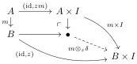

E. Cavallo and C. Sattler

23

## 7.1 Orton–Pitts models

Orton and Pitts [26] give an abstract description of Cohen, Coquand, Huber, and Mörtberg's model of cubical type theory in De Morgan cubical sets [12]. Abstracting from the case of cubical sets, they fix a topos $\mathcal{E}$ equipped with an interval object $I$ and a suitable subobject $\Omega_{\mathrm{cof}} \mapsto \Omega$ of the subobject classifier and isolate axioms on this data sufficient to construct a model of a strict cubical type theory in $\mathcal{E}$ where the interval is interpreted by $I$ and the cofibrations by $\Omega_{\mathrm{cof}}$. They assume that the interval $I$ has connections, but Angiuli, Brunerie, Coquand, Harper, Favonia, and Licata (ABCHFL) [2] subsequently gave a similar construction for intervals without such structure. Extracting what we need from their main result and rephrasing in our language, we have:

▶ Proposition 67 ([2, Theorem 2]). Let $\mathcal{E} = \mathrm{PSh}(\mathcal{C})$ be a presheaf category on a finite product category $\mathcal{C}$, let $I \in \mathcal{E}$ be a representable object with distinct points $0, 1: 1 \to I$, and let $\Omega_{\mathrm{cof}} \mapsto \Omega_{\mathrm{dec}}$ be a subobject of the levelwise decidable subobject classifier in $\mathrm{PSh}(\mathcal{C})$ that classifies the diagonal $I \to I \times I$ and is closed under finite conjunction, finite disjunction, and universal quantification over $I$. Then there is a model $\mathcal{M}$ of $\mathbb{C}\mathrm{TT}_s$ such that

(a) $\mathcal{M}(\star) = \mathcal{E}$.
(b) $\mathcal{M}(\mathbb{I}) = \mathcal{K}I \in \mathrm{PSh}(\mathcal{E})$.
(c) the maps $p_A: \Gamma.A \to \Gamma$ arising as pullbacks in $\mathrm{PSh}(\mathcal{E})$ of $\mathcal{M}(\pi_{\mathrm{Tm}})$ are those equipped with a diagonal Kan composition structure [2, Definition 1].

This model interprets the interval theory of all $f: I^n \to I$ in $\mathcal{C}$ and equations between them.

We call $(\mathcal{C}, I, 0, 1, \Omega_{\mathrm{cof}})$ satisfying the conditions of Proposition 67 an ABCHFL setup and write $\mathcal{M}(\mathcal{C}, 0, 1, I, \Omega_{\mathrm{cof}})$ for the resulting model. The maps with diagonal Kan composition structure can be described by a simple lifting property. Awodey proves the following for cartesian cubical sets, but the same proof applies in the setting of Proposition 67.

▶ Proposition 68 ([5, Proposition 4.15(2)⇔(3)]). Let $(\mathcal{C}, I, 0, 1, \Omega_{\mathrm{cof}})$ be an ABCHFL setup. A morphism $f: Y \to X$ admits a diagonal Kan composition structure if and only if it has the right lifting property against the unique dashed map

for every $m: A \mapsto B$ classified by $\Omega_{\mathrm{cof}}$ and $z: B \to I$.

We call a map an $(I, \Omega_{\mathrm{cof}})$-fibration when it satisfies the property in Proposition 68. As a lifting property, it is closed under retracts [27, Lemma 11.1.4].

▶ Proposition 69. If $(\mathcal{C}, I, 0, 1, \Omega_{\mathrm{cof}})$ is an ABCHFL setup, then $(\mathcal{C}, I \times I, r, s, \Omega_{\mathrm{cof}})$ is an ABCHFL setup for every $r \neq s: 1 \to I \times I$. Moreover, the classes of $(I \times I, \Omega_{\mathrm{cof}})$- and $(I, \Omega_{\mathrm{cof}})$-fibrations coincide.

Proof. Because $\mathcal{C}$ is a finite product category by assumption, $I \times I$ is also representable. The diagonal $\Delta_{I \times I}: I \times I \to (I \times I) \times (I \times I)$ is the conjunction of $(\pi_0 \times \pi_0)^* \Delta_I$ and $(\pi_1 \times \pi_1)^* \Delta_I$, the pullbacks of $\Delta_I: I \to I \times I$ along the projections $\pi_0 \times \pi_0, \pi_1 \times \pi_1: (I \times I) \times (I \times I) \to I \times I$. Thus it is classified by $\Omega_{\mathrm{cof}}$. Universal quantification of $I \times I$ is iterated universal quantification over $I$, so $\Omega_{\mathrm{cof}}$ is closed under this operation. This completes the proof of the first claim.