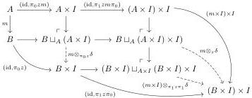

24

Eliminating reversals from cubical type theories

For the second claim, recall that the class of maps with the left lifting property against a map is closed under retracts, composition, and pushouts along arbitrary maps [27, Lemma 11.1.4]. Given \( m \colon A \mapsto B \) classified by \( \Omega_{\mathrm{cof}} \) and \( z \colon B \to I \), we can write \( m \otimes_z \delta \) as a retract of \( m \otimes_{z \times 0} \delta \) where \( z \times 0 \colon B \to I \times I \):

\[
\begin{array}{c} B \sqcup_ {A} (A \times I) \longrightarrow B \sqcup_ {A} (A \times (I \times I)) \longrightarrow B \sqcup_ {A} (A \times I) \\ m \otimes_ {z} \delta \Biggl \downarrow \qquad \qquad \qquad \qquad \qquad \qquad \qquad \qquad \qquad \qquad \qquad \qquad \qquad \qquad \qquad \qquad \qquad \qquad \qquad \qquad \qquad \qquad \qquad \qquad \qquad \qquad \qquad \qquad \qquad \qquad \qquad \qquad \qquad \qquad \\ B \times I \xrightarrow [ B \times (I \times 0) ]{} B \times (I \times I) \xrightarrow [ B \times \pi_ {0} ]{} B \times I. \end{array}
\]

Thus every \((I\times I,\Omega_{\mathrm{cof}})\)-fibration is an \((I,\Omega_{\mathrm{cof}})\)-fibration. For the converse, given \(m\colon A\mapsto B\) classified by \(\Omega_{\mathrm{cof}}\) and \(z\colon B\to I\times I\), we read off the commutative diagram

that \(m \otimes_z \delta\) is a composite of a pushout of \(m \otimes_{\pi_0 z} \delta\) and \((m \times I) \otimes_{\pi_1 z \pi_1} \delta\). This semantic counterpart to Component 32 shows that all \((I, \Omega_{\mathrm{cof}})\)-fibrations are \((I \times I, \Omega_{\mathrm{cof}})\)-fibrations.

Using Proposition 69, we can turn any ABCHFL model that presents \(\infty\)-groupoids into an ABCHFL model with reversals that also presents \(\infty\)-groupoids. A suitable input is the category of presheaves on the semilattice cube category \(\square_{\vee}\), i.e., the cartesian cube category with one connection. This is the algebraic theory generated by an object \(I\) with points \(0,1:1\to I\) and a connection \(\vee:I\times I\to I\) satisfying the axioms of a bounded join-semilattice.

▶ Proposition 70 ([11, Theorems 4.34 & 7.8]). The ABCHFL model  \( \mathcal{M}(\Box_{\vee}, I, 0, 1, \Omega_{\mathrm{dec}}) \)  presents a Quillen model structure. Assuming classical logic, this model structure presents the  \( (\infty, 1) \) -category of  \( \infty \) -groupoids.
Theorem 71. The ABCHFL model \(\mathcal{M}(\square_{\vee}, I \times I, (0,1), (1,0), \Omega_{\mathrm{dec}})\) interprets strict cubical type theory with reversals and presents a Quillen model structure. Assuming classical logic, this model structure presents the \((\infty,1)\)-category of \(\infty\)-groupoids.

Proof. Propositions 67 and 69 give the existence of the model of type theory. The existence of the model structure can be established by following Awodey's construction [5], but he considers only the cartesian cube category with its canonical interval object. The necessary components appear in generality in Awodey et al. [6, Lemma 3.7.2, Proposition 3.7.3] (compare [6, Theorem 4.4.9]). By Proposition 69 and the uniqueness of the model structure presented by a model of type theory, this model structure is the same as that presented by \(\mathcal{M}(\square_{\vee}, I, 0, 1, \Omega_{\mathrm{dec}})\), so Proposition 70 proves the final claim.

Although the original interval \( I \) in \( \square_{\vee} \) has a connection, this is not the case for \( I \times I \) with the endpoints \( (0,1) \) and \( (1,0) \): in order to give the definition \( (i_0,i_1)\vee (j_0,j_1):= (i_0\vee j_0,i_1\wedge j_1) \) from §1.1, we need both connections in the base model. Thus we only model cubical type theory with a reversal, not with a connection. We expect that we can apply the procedure in this section to the second author's model of cubical type theory with two connections [32], even though it is not an ABCHFL model, but we leave this to future work.