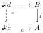

E. Cavallo and C. Sattler

5

example, dependent sums are specified by the declarations

\(\Sigma : (\mathsf{A}:\mathsf{Ty},\mathsf{B}:\mathsf{A}\to \mathsf{Ty})\Rightarrow \mathsf{Ty}\)   
fst : ([A:Ty,B:A \(\rightarrow\) Ty], \(\Sigma (\mathsf{A},\mathsf{B}))\Rightarrow \mathsf{A}\)   
snd : ([A:Ty,B:A \(\rightarrow\) Ty], \(\Sigma (\mathsf{A},\mathsf{B}))\Rightarrow \mathsf{B}(\mathsf{a})\)   
pair : ([A:Ty,B:A \(\rightarrow\) Ty],a:A,b:B(a)) \(\Rightarrow \Sigma (\mathsf{A},\mathsf{B})\)

and, over \(\Phi_{\Sigma} = (\mathsf{A}:\mathsf{Ty},\mathsf{B}:\mathsf{A}\to \mathsf{Ty})\) , equations

\(\begin{array}{ll} & : & (\Phi_{\Sigma}, \mathsf{a}: \mathsf{A}, \mathsf{b}: \mathsf{B}(\mathsf{a})) \Rightarrow \mathsf{fst}(\mathsf{pair}(\mathsf{a}, \mathsf{b})) \equiv \mathsf{a}: \mathsf{A}\\ & : & (\Phi_{\Sigma}, \mathsf{a}: \mathsf{A}, \mathsf{b}: \mathsf{B}(\mathsf{a})) \Rightarrow \mathsf{snd}(\mathsf{pair}(\mathsf{a}, \mathsf{b})) \equiv \mathsf{b}: \mathsf{B}(\mathsf{a})\\ & : & (\Phi_{\Sigma}, \mathsf{s}: \Sigma(\mathsf{A}, \mathsf{B})) \Rightarrow \mathsf{s} \equiv \mathsf{pair}(\mathsf{fst}(\mathsf{s}), \mathsf{snd}(\mathsf{s})): \Sigma(\mathsf{A}, \mathsf{B}) \end{array}\)

▶ Notation 3. We write  \( MLTT_{\Sigma,ld} \)  for the extension of MLTT with  \( \Sigma \)  types, unit types (which we think of as nullary  \( \Sigma \)  types), and identity types [37, Examples 4.6.4–4.6.6]. We write  \( MLTT_{\Sigma,ld,\Pi} \)  for its further extension with  \( \Pi \)  types [37, Example 4.6.3].

▶ Notation 4. We write  \( \Sigma a:A \) . B as shorthand for  \( \Sigma(A,\langle\mathsf{a}\rangle B) \) , where  \( \langle\mathsf{a}\rangle \)  denotes abstraction over the variable a. If B does not depend on a, we write  \( A\times B \) . We write  \( (a,b) \)  for the pairing pair  \( (a,b) \)  and s.1 and s.2 for fst(s) and snd(s), respectively. For  \( \Pi \)  types, we write  \( \Pi a:A \) . B for  \( \Pi(A,\langle\mathsf{a}\rangle B) \)  and  \( A\to B \)  when B does not depend on a. For identity types, we write the type  \( \operatorname{Id}(A,a_{0},a_{1}) \)  of identities in A from  \( a_{0} \)  to  \( a_{1} \)  as  \( a_{0}\asymp^{A}a_{1} \)  or  \( a_{0}\asymp a_{1} \) .

▶ Notation 5. The unit type and dependent sums justify types of dependent n-tuples for  \( n \geq 0 \) . We write these with tupling  \( (a_{1}, \ldots, a_{n}) \)  and projections  \( s.1, \ldots, s.n \) .

### 2.2 Representable map categories

To specify the notion of model of a SOGAT, Uemura first introduces representable map categories, also called categories with representable maps.

▶ Definition 6 (Uemura [37, Definition 3.2.1]). A representable map category (RMC) is a finite limit category R equipped with a class of morphisms, the representable maps, such that (a) the representable maps are closed under pullback, and
(b) for each representable map  \( f: Y \to X \) , the pullback functor  \( f^{*}: R/X \to R/Y \)  has a right adjoint  \( f_{*}: R/Y \to R/X \)  (called pushforward).

We use the arrow style  \( \rightarrow \)  to indicate representable maps. A representable map functor or RMC functor  \( F: R \rightarrow S \)  between representable map categories is a functor that preserves finite limits, representable maps, and pushforwards along representable maps.

▶ Example 7 (Uemura [37, Example 3.2.2]). Let C be a small category. The category of presheaves PSh(C) becomes an RMC when equipped with the class of morphisms  \( f: B \to A \)  such that for every map  \( a: \&c \to A \)  from a representable presheaf, there is a pullback square

for some \(d\in \mathcal{C}\)

The collection of representable map categories, representable map functors between them, and natural isomorphisms defines a  \( (2,1) \) -category RMC. Each SOGAT T induces