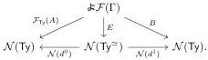
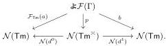

E. Cavallo and C. Sattler

7

### 2.4 Weak equivalences

Kapulkin and Lumsdaine [22, Definition 3.1] define weak equivalences of contextual categories with identity types. We translate their definition into Uemura's framework as a property of morphisms in \(\mathbf{Mod}(\mathbb{MLTT}_{\Sigma,\mathrm{Id}})\). First, we define the environment \(\mathsf{Ty}^{\simeq}\) of 1-to-1 correspondences, pairs of types connected by a type-valued relation that associates each element of one type with a unique element of the other. This is one way of defining equivalence between types [39, Exercise 4.2]. Similarly, we have an environment \(\mathsf{Tm}^{\simeq}\) of pairs of identified elements within a type.

▶ Definition 10. Over A : Ty, define  \( \Phi_{\text{isContr}}(A) := (a_0: A, p : (a_1: A) \to a_0 \asymp^A a_1) \) . Write  \( Ty^{\simeq} \in MLTT_{\Sigma, Id} \)  for

\[
\begin{array}{l} (\mathsf {A}: \mathsf {T y}, \mathsf {A} ^ {\prime}: \mathsf {T y}, \overline {{\mathsf {A}}}: (\mathsf {a}: \mathsf {A}, \mathsf {a} ^ {\prime}: \mathsf {A} ^ {\prime}) \to \mathsf {T y}, \\ \_ : (\mathsf {a}: \mathsf {A}) \to \Phi_ {\text {isContr}} (\Sigma \mathsf {a} ^ {\prime}: \mathsf {A} ^ {\prime}. \overline {{\mathsf {A}}} (\mathsf {a}, \mathsf {a} ^ {\prime})), \_ : (\mathsf {a} ^ {\prime}: \mathsf {A} ^ {\prime}) \to \Phi_ {\text {isContr}} (\Sigma \mathsf {a}: \mathsf {A}. \overline {{\mathsf {A}}} (\mathsf {a}, \mathsf {a} ^ {\prime}))) \\ \end{array}
\]

and \(d^0, d^1: \mathsf{Ty}^\simeq \to \mathsf{Ty}\) for the maps projecting \(\mathsf{A}\) and \(\mathsf{A}'\) respectively.

▶ Definition 11. Set \(\mathsf{Tm}^{\simeq} := (\mathsf{A} : \mathsf{Ty}, \mathsf{a} : \mathsf{A}, \mathsf{a}' : \mathsf{A}, \overline{\mathsf{a}} : \mathsf{a} \asymp^{\mathsf{A}} \mathsf{a}')\) and write \(d^{0}, d^{1} : \mathsf{Tm}^{\simeq} \to \mathsf{Tm}\) for the maps projecting \((\mathsf{A}, \mathsf{a})\) and \((\mathsf{A}, \mathsf{a}')\).
▶ Definition 12. A morphism \(\mathcal{F}\colon\mathcal{M}\to\mathcal{N}\) in \(\mathbf{Mod}(\mathbb{MLTT}_{\Sigma,\mathrm{Id}})\) is a weak equivalence if the following hold for all \(\Gamma\in\mathcal{M}(\star)\):

(a) weak type lifting: for every \(B\colon \mathcal{F}(\Gamma)\to \mathcal{N}(\mathsf{Ty})\) , there exist \(A\colon \mathcal{F}\Gamma \to \mathcal{M}(\mathsf{Ty})\) and \(E\colon \mathcal{F}(\Gamma)\to \mathcal{N}(\mathsf{Ty}^{\simeq})\) fitting in a commutative diagram

(b) weak term lifting: for every \(A\colon \mathcal{F}(\Gamma)\to \mathcal{N}(\mathsf{Ty})\) and \(b\colon \mathcal{F}\Gamma \to \mathcal{M}(\mathsf{Tm})\) with \(\pi_{\mathsf{Tm}}b = \mathcal{F}_{\mathsf{Ty}}(A)\), there exist \(a\colon \mathcal{F}\Gamma \to \mathcal{M}(\mathsf{Tm})\) with \(\pi_{\mathsf{Tm}}a = A\) and \(p\colon \mathcal{F}(\Gamma)\to \mathcal{N}(\mathsf{Tm}^{\simeq})\) fitting in a commutative diagram

Though we state Definition 12 for arbitrary models, it is generally only well-behaved for democratic models. In informal turnstile notation, \(\mathcal{F}\colon \mathcal{M}\to \mathcal{N}\) is a weak equivalence when (a) for every type \(\mathcal{F}(\Gamma)\vdash_{\mathcal{N}}B\) in the target model, there is a type \(\Gamma \vdash_{\mathcal{M}}A\) in the source model whose image by \(\mathcal{F}\) is equivalent to \(B\), and (b) for every term \(\mathcal{F}(\Gamma)\vdash_{\mathcal{N}}b:\mathcal{F}_{\mathrm{Ty}}(A)\) in the target model, there is a term \(\Gamma \vdash_{\mathcal{M}}a:A\) whose image by \(\mathcal{F}\) is identified with \(b\).

We apply the notion of weak equivalence to “syntactic” models of  \( MLTT_{\Sigma,Id} \) , coming from extensions of the SOGAT of  \( MLTT_{\Sigma,Id} \) , in order to speak about conservativity relations between type theories (cf. for example Isaev [20], Bocquet [7], Kapulkin and Li [21]).

▶ Definition 13. For an RMC functor \(F\colon\mathbb{R}\to\mathbb{S}\), we write \(\mathbf{0}_{F}:=(\mathbb{R},\mathcal{F}\circ F)^{\heartsuit}\in\mathbf{Mod}(\mathbb{R})\) for the heart of the model of \(\mathbb{R}\) given by the RMC functor \(\mathbb{R}\xrightarrow{F}\mathbb{S}\xrightarrow{\mathcal{F}}\mathrm{PSh}(\mathbb{S})\). When \(F\) is understood from context, we write \(\mathbf{0}_{\mathbb{S}}\in\mathbf{Mod}(\mathbb{R})\).