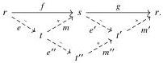

10

E. Cavallo and C. Sattler

that this definition is self-dual: if R is a Reedy category, then R^op is a Reedy category with the same degree function but with lowering and raising maps swapped.

Terminology 2.12 We henceforth drop the qualifier generalized, as we are almost always working with generalized Reedy categories. Instead, we say a Reedy category is strict if any parallel isomorphisms are equal and it is skeletal, i.e., it is a Reedy category in the original sense.

The prototypical strict Reedy category is the simplex category Δ: the degree of an n-simplex is n, while the lowering and raising maps are the degeneracy and face maps respectively [GZ67, §II.3.2].

A Reedy structure on a category R is essentially a tool for working with R-shaped diagrams. For example, a weak factorization system on any category E induces injective and projective Reedy weak factorization systems on the category [R, E] of R-shaped diagrams in E; likewise for model structures. Importantly for us, any diagram of shape R can be regarded as built iteratively from "partial" diagrams specifying the elements at indices up to a given degree. We are specifically interested in presheaves, i.e., R^op-shaped diagrams in Set. We refer to [DHKS04, §22; BM11; RV14; Shu15] for overviews of Reedy categories and their applications.

Berger and Moerdijk's definition of generalized Reedy category [BM11, Definition 1.1] includes one additional axiom. Following Riehl [Rie17], we treat this as a property to be assumed only where necessary:

Definition 2.13 In a Reedy category R, we say isos act freely on lowering maps when for any e : r → s and isomorphism θ : s ≅ s, if θe = e then θ = id.

Note that any Reedy category in which all lowering maps are epic satisfies this property. The main results of this paper are restricted to pre-elegant Reedy categories (Definition 5.28) for which this is always the case (Lemma 5.29); nevertheless, we try to record where only the weaker assumption is needed.

The following cancellation property will come in handy.

Lemma 2.14 Let f : r → s, g : s → t be maps in a Reedy category. If gf is a lowering map, then so is g. Dually, if gf is a raising map, then so is f.

Proof We prove the first statement; the second follows by duality. Suppose gf is a lowering map. We take Reedy factorizations f = me, g = m'e', and then e'm = m''e'':

2025/10/16 00:43