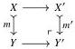

12

E. Cavallo and C. Sattler

(a) $\mathcal{P}$ is closed under small coproducts;
(b) For every pushout square

such that $X, X', Y \in \mathcal{P}$, we have $Y' \in \mathcal{P}$;

(c) For every diagram $X: \omega \to \mathbf{E}$ such that each object $X^i$ is in $\mathcal{P}$ and each morphism $X^i \to X^{i+1}$ is monic, we have $\operatorname{colim}_{i < \omega} X^i \in \mathcal{P}$.

We note that when $\mathbf{E}$ is a model category with monos as cofibrations, these are all diagrams whose colimits agree with their homotopy colimits: we can compute their colimits in the $(\infty, 1)$-category presented by $\mathbf{E}$ by simply computing their 1-categorical colimits in $\mathbf{E}$, which is hardly the case in general. This fact is another application of Reedy category theory; see for example Dugger [Dug08, §14]. As a result, these colimits have homotopical properties analogous to 1-categorical properties of colimits. For example, recall that given a natural transformation $\alpha: F \to G$ between left adjoint functors $F, G: \mathbf{E} \to \mathbf{F}$, the class of $X \in \mathbf{E}$ such that $\alpha_X$ is an isomorphism is closed under colimits. If $F, G$ are left Quillen adjoints and $\mathbf{E}, \mathbf{F}$ have monomorphisms as cofibrations, then the class of $X$ such that $\alpha_X$ is a weak equivalence is saturated by monomorphisms. This particular fact will be key in Section 7.1.

For presheaves over an elegant Reedy category, the basic cells are the quotients of representables by automorphism subgroups.

Definition 2.19 Given an object $X$ of a category $\mathbf{E}$ and a subgroup $H \leq \operatorname{Aut}_{\mathbf{E}}(X)$, their quotient is the colimit $X/H := \operatorname{colim}(H \to \operatorname{Aut}_{\mathbf{E}}(X) \to \mathbf{E})$.

Proposition 2.20 Let $\mathbf{R}$ be an elegant Reedy category. Let $\mathcal{P} \subseteq \operatorname{PSh}(\mathbf{R})$ be a class of objects such that

- for any $r \in \mathbf{R}$ and $H \leq \operatorname{Aut}_{\mathbf{R}}(r)$, we have $\not\leq r/H \in \mathcal{P}$;
- $\mathcal{P}$ is saturated by monomorphisms.

Then $\mathcal{P}$ contains all objects of $\operatorname{PSh}(\mathbf{R})$.

Proof [Cis19, Corollary 1.3.10] gives a proof for strict elegant Reedy categories; the proof for the generalized case is similar (and a special case of our Theorem 5.47).

As described above, we will be studying a category $\square_{\vee}$ that is not a Reedy category. Thus, we will not use the previous proposition directly. Instead, our Section 5 establishes a generalization to categories that only embed in a Reedy category in a nice way.

### 2.4 Simplicial sets

To show that a given model category presents $\infty$-Gpd, it suffices to exhibit a Quillen equivalence to a model category already known to present $\infty$-Gpd. Here, our standard of

2025/10/16 00:43