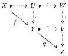

Relative Elegance and Cartesian Cubes with One Connection

15

Proposition 3.5 $C_t = C \cap \mathcal{W}(C, \mathcal{F})$ and $\mathcal{F}_t = \mathcal{F} \cap \mathcal{W}(C, \mathcal{F})$.

Proof An immediate consequence of the retract argument [Hov99, Lemma 1.1.9].

In light of the above, we use the arrows $\leftrightarrow$ and $\Rightarrow$ to denote trivial cofibrations and fibrations also in a premodel structure.

Corollary 3.6 $(C, \mathcal{W}(C, \mathcal{F}), \mathcal{F})$ forms a model structure if and only if $\mathcal{W}(C, \mathcal{F})$ satisfies 2-out-of-3.

We now reduce the problem of checking 2-out-of-3 for $\mathcal{W}(C, \mathcal{F})$ to a reduced collection of special cases of 2-out-of-3 where some or all maps belong to $C$ or $\mathcal{F}$.

Definition 3.7 Given a wide subcategory $\mathcal{A} \subseteq \mathbf{E}$ of a category $\mathbf{E}$, we say $\mathcal{A}$ has left cancellation in $\mathbf{E}$ (or among maps in $\mathbf{E}$) when for every composable pair $g, f$ in $\mathbf{E}$, if $gf$ and $g$ are in $\mathcal{A}$ then $f$ is in $\mathcal{A}$. Dually, $\mathcal{A}$ has right cancellation in $\mathbf{E}$ when for all $g, f$ with $gf, f \in \mathcal{A}$, we have $g \in \mathcal{A}$.

Theorem 3.8 $\mathcal{W}(C, \mathcal{F})$ satisfies 2-out-of-3 exactly if the following hold:

- (A) trivial cofibrations have left cancellation among cofibrations and trivial fibrations have right cancellation among fibrations.
- (B) any (cofibration, trivial fibration) factorization or (trivial cofibration, fibration) factorization of a weak equivalence is a (trivial cofibration, trivial fibration) factorization;
- (C) any composite of a trivial fibration followed by a trivial cofibration is a weak equivalence.

Note that each of these conditions is self-dual.

Proof Conditions A–C all follow by straightforward applications of 2-out-of-3 for $\mathcal{W}(C, \mathcal{F})$. Suppose conversely that we have A–C and let maps $g: Y \to Z$ and $f: X \to Y$ be given. Then using the two factorization systems and condition C, we have the following diagram:

Suppose first that $g$ and $f$ are weak equivalences. Then we may choose the factorizations of $f$ and $g$ such that the map $X \leftrightarrow U$ is a trivial cofibration and the map $V \to Z$ is a trivial fibration. Thus $gf$ factors as a trivial cofibration followed by a trivial fibration, i.e., is a weak equivalence.

Now suppose that $f$ and $gf$ are weak equivalences. We may choose the factorization of $f$ such that the map $X \leftrightarrow U$ is a trivial cofibration. The composite $X \leftrightarrow W$ is then a trivial cofibration, so the composite $W \to Z$ is a trivial fibration by condition B. Then

2025/10/16 00:43