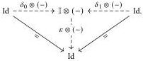

16

E. Cavallo and C. Sattler

the map $V \to Z$ is a trivial fibration by condition A. Hence $g$ is a weak equivalence. By the dual argument, if $g$ and $gf$ are weak equivalences then so is $f$.

### 3.2 Cylindrical premodel structures

Now we derive a simpler set of criteria for premodel structures equipped with a compatible adjoint functorial cylinder.

Definition 3.9 A functorial cylinder on a category $\mathbf{E}$ is a functor $\mathbb{I} \otimes (-): \mathbf{E} \to \mathbf{E}$ equipped with endpoint and contraction transformations fitting in a diagram as shown:

An adjoint functorial cylinder is a cylinder such that $\mathbb{I} \otimes (-)$ is a left adjoint.

Notation 3.10 Given a functorial cylinder in a finitely cocomplete category, we have induced boundary maps $\partial \otimes X := [\delta_0 \otimes X, \delta_1 \otimes X]: X \sqcup X \to \mathbb{I} \otimes X$.

There is a dual notion of functorial path object consisting of a functor $\mathbb{I} \oslash (-)$ and natural transformations $\delta_k \oslash (-): \mathbb{I} \otimes (-) \to \mathrm{Id}$ and $\varepsilon \oslash (-): \mathrm{Id} \to \mathbb{I} \otimes (-)$. By transposition, each adjoint functorial cylinder corresponds to an adjoint functorial path object.

Remark 3.11 (Stability under (co)slicing) Fix a functorial cylinder denoted as above and an object $X \in \mathbf{E}$. Then $\mathbb{I} \otimes (-)$ lifts through the forgetful functor $\mathbf{E}/X \to \mathbf{E}$ to a functorial cylinder $\mathbb{I} \otimes_{\mathbf{E}/X} (-)$ on the slice over $X$. This crucially uses the contraction. For example, the action of $\mathbb{I} \otimes_{\mathbf{E}/X} (-)$ on $f: Y \to X$ is given by $(\varepsilon \otimes X)(\mathbb{I} \otimes f): \mathbb{I} \otimes Y \to X$. Furthermore, $\mathbb{I} \otimes (-)$ lifts through the pushout functor $\mathbf{E} \to X/\mathbf{E}$ to a functorial cylinder $\mathbb{I} \otimes_{X/\mathbf{E}} (-)$ on the coslice under $X$. For example, the action of $\mathbb{I} \otimes_{X/\mathbf{E}} (-)$ on $f: X \to Y$ is given by the pushout of $\mathbb{I} \otimes f: \mathbb{I} \otimes X \to \mathbb{I} \otimes Y$ along $\varepsilon \otimes X$. In both cases, adjointness is preserved, and the corresponding functorial path object is given by performing the dual construction.

Definition 3.12 Write @: $[\mathbf{E}, \mathbf{F}] \times \mathbf{E} \to \mathbf{F}$ for the application bifunctor defined by $F @ X := F(X)$. Given a category $\mathbf{E}$ with a functorial cylinder and $f \in \mathbf{E}^\to$, we abbreviate $(\delta_k \otimes (-)) \widehat{\otimes} f \in \mathbf{E}^\to$ as $\delta_k \widehat{\otimes} f$. We likewise write $\varepsilon \widehat{\otimes} f$ for Leibniz application of the contraction. We write $\delta_k \widehat{\oslash} (-)$ and $\varepsilon \widehat{\oslash} (-)$ for the dual operations associated to a functorial path object.

Definition 3.13 Given a finitely cocomplete category $\mathbf{E}$ with a functorial cylinder, a weak factorization system $(\mathcal{L}, \mathcal{R})$ is cylindrical when $\partial \widehat{\otimes} (-)$ preserves left maps.

2025/10/16 00:43