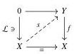
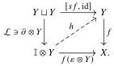
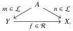
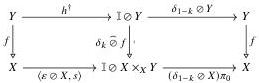

18

E. Cavallo and C. Sattler

Lemma 3.19 Let $$(\mathcal{L}, \mathcal{R})$$ be a cylindrical weak factorization system on a finitely cocomplete category with a functorial cylinder. Then any $$\mathcal{R}$$-map between $$\mathcal{L}$$-objects is a dual strong $$k$$-oriented deformation retract for any $$k \in \{0, 1\}$$.

Proof Let $$f: Y \to X$$ be an $$\mathcal{R}$$-map between $$\mathcal{L}$$-objects. We solve two lifting problems in turn:

The maps $$s$$ and $$h$$ exhibit $$f$$ as a dual strong 0-oriented deformation retract; we may similarly construct a 1-oriented equivalent.

Corollary 3.20 Let $$(\mathcal{L}, \mathcal{R})$$ be a cylindrical weak factorization system on a category with a functorial cylinder. Then in any diagram of the form

the horizontal map is a dual strong $$k$$-oriented deformation retract for any $$k \in \{0, 1\}$$.

Proof By Lemma 3.19, applied in the coslice under $$A$$ via Remark 3.17.

Lemma 3.21 If $$\mathbf{M}$$ is cylindrical, then any fibration $$f: Y \to X$$ that is a dual strong $$k$$-oriented deformation retract for some $$k \in \{0, 1\}$$ is a trivial fibration.

Proof Let $$s: X \to Y$$ and $$h: \mathbb{I} \otimes Y \to Y$$ be as in the definition of dual strong $$k$$-oriented deformation retract. Then the diagram

exhibits $$f$$ as a retract of a trivial fibration.

Lemma 3.22 Suppose $$\mathbf{M}$$ is cylindrical. If trivial fibrations have right cancellation among fibrations, then any (trivial cofibration, fibration) factorization of a weak equivalence is a (trivial cofibration, trivial fibration) factorization.

Dually, if trivial cofibrations have left cancellation among cofibrations, then any (cofibration, trivial fibration) factorization of a weak equivalence is a (trivial cofibration, trivial fibration) factorization.

2025/10/16 00:43