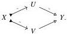
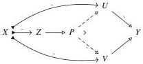

Relative Elegance and Cartesian Cubes with One Connection

19

Proof Suppose we have a weak equivalence $X \to Y$ factoring as a trivial cofibration followed by a fibration, thus a diagram of the following form:

We first take a pullback and factorize the induced gap map as a trivial cofibration followed by a fibration.

By Corollary 3.20, the composites $Z \to U$ and $Z \to V$ are dual strong deformation retracts, thus trivial fibrations by Lemma 3.21. Then the composite $Z \to Y$ is a trivial fibration by composition, so $V \to Y$ is a trivial fibration by right cancellation.

Theorem 3.23 Suppose $\mathbf{M}$ is a cylindrical premodel structure. Then $\mathcal{W}(\mathcal{C}, \mathcal{F})$ satisfies 2-out-of-3 exactly if the following hold:

- (A) trivial cofibrations have left cancellation among cofibrations and trivial fibrations have right cancellation among fibrations;
- (C) any composite of a trivial fibration followed by a trivial cofibration is a weak equivalence.

Proof Theorem 3.8 combined with Lemma 3.22.

Finally, we prove for reference below that the cancellation properties opposite of condition A always hold in a cylindrical premodel structure, though we will not need this fact.

Lemma 3.24 Let $(\mathcal{L}, \mathcal{R})$ be a cylindrical weak factorization system on a category with a functorial cylinder. If $f$ is a map between $\mathcal{L}$-objects, then the first factor of its $k$-sided mapping cylinder factorization is an $\mathcal{L}$-map.

Proof The first factor $A \to M_k(f)$ in the factorization of $f: A \to B$ decomposes as the composite

$$A \xrightarrow{\iota_0} A \sqcup B \xrightarrow{\cong} (A \sqcup A) \sqcup_A B \xrightarrow{(\partial \otimes A) \sqcup_A B} \mathbb{I} \otimes A \sqcup_A B.$$

The first map is a cobase change of $0 \to B$, thus an $\mathcal{L}$-map. The last map is a cobase change of $\partial \otimes A \cong \partial \widehat{\otimes} (0 \to A)$, thus also an $\mathcal{L}$-map.

2025/10/16 00:43