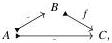

20

E. Cavallo and C. Sattler

Lemma 3.25 If M is cylindrical, then any cofibration between trivially cofibrant objects is a trivial cofibration. Dually, any fibration between trivially fibrant objects is a trivial fibration.

Proof Let m: A ↦ B be a cofibration between trivially cofibrant objects. Consider the commutative square

$$\begin{array}{c} A \xmapsto{\iota_0(\delta_1 \otimes A)} M_0(m) \\ m \downarrow \\ B \xrightarrow{\delta_1 \otimes B} \mathbb{I} \otimes B. \end{array}$$

The top horizontal map is a trivial cofibration by Lemma 3.24, while the right vertical map is a trivial cofibration by cylindricality. The bottom map is split monic, so m is a retract of a trivial cofibration and thus a trivial cofibration itself.

Corollary 3.26 (Sat17, Lemma 4.5(iii)) If M is cylindrical, then trivial cofibrations have right cancellation among cofibrations. Dually, trivial fibrations have left cancellation among fibrations.

Proof Given a diagram

we apply Lemma 3.25 to f in the coslice under A via Remark 3.17.

### 3.3 Model structures from the fibration extension property

We now narrow our attention to premodel structures satisfying properties common to cubical-type model structures: first, that all objects are cofibrant, and second, that fibrations extend along trivial cofibrations, the latter of which follows in particular from the existence of enough fibrant universes classifying fibrations. Note that our conditions cease to be self-dual at this point; moreover, the result is a criterion sufficient but not necessary to obtain a model structure.

Lemma 3.27 Let M be a premodel category. Trivial fibrations have right cancellation in M if and only if the (cofibration, trivial fibration) factorization system is generated by cofibrations between cofibrant objects. Dually, trivial cofibrations have left cancellation in M if and only if the (trivial cofibration, fibration) factorization system is cogenerated by fibrations between fibrant objects.

Proof Suppose trivial fibrations have right cancellation in M and let p: Y → X be a map lifting against cofibrations between cofibrant objects. We take a cofibrant replacement of Y, obtaining maps 0 ↦ Y' → Y. By cancellation, it suffices to show the composite p': Y' → X is a trivial fibration. We appeal to the retract argument: p' has the lifting property against the left part of its (cofibration, trivial fibration)

2025/10/16 00:43