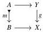
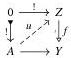
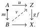
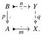
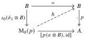

Relative Elegance and Cartesian Cubes with One Connection

21

factorization—this being a cofibration between cofibrant objects—so is a retract of the right part of its factorization. It is thus itself a trivial fibration.

The converse is an elementary exercise in lifting. Suppose the (cofibration, trivial fibration) factorization system is generated by cofibrations between cofibrant objects, let $f: Z \to Y$ and $g: Y \to X$ be such that $gf$ is a trivial fibration. Given a cofibration $m: A \mapsto B$ between cofibrant objects and a lifting problem

we solve lifting problems first against $f$ and then against $gf$:

The composite $fv$ is a lift for the original square.

In particular, Lemma 3.27 tells us that trivial fibrations have right cancellation in any premodel structure where all objects are cofibrant. If the premodel structure is additionally cylindrical, then condition C is also always satisfied:

Lemma 3.28 Let $\mathbf{M}$ be cylindrical and suppose that all objects are cofibrant. Then any composite of a trivial fibration followed by a trivial cofibration is a weak equivalence.

Proof Suppose we have $p: B \to A$ and $m: A \mapsto X$. We take their composite's (trivial cofibration, fibration) factorization:

We intend to show $q$ is a trivial fibration. By Corollary 3.20 and the assumption that all objects are cofibrant, $p$ has the structure of a dual strong 0-oriented deformation retract. Thus we have a diagonal lift

2025/10/16 00:43