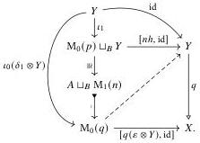

22

E. Cavallo and C. Sattler

Using that $q$ is a fibration, we show that $q$ is a dual strong deformation retract by solving a lifting problem of the form

The map $A \sqcup_B \mathrm{M}_1(n) \mapsto \mathrm{M}_0(q)$ is the following composite:

$$\begin{array}{c} A \sqcup_B \mathrm{M}_1(n) \xrightarrow{\quad} X \sqcup_B \mathrm{M}_1(n) \xrightarrow{\quad} X \sqcup_Y (\mathbb{I} \otimes B \sqcup_B (Y \sqcup Y)) \xrightarrow{\quad} \mathrm{M}_0(q) \\ m \sqcup_B \mathrm{M}_1(n) \hspace{4em} X \sqcup_Y (\partial \otimes n) \end{array}$$

The first map is a cobase change of the trivial cofibration $m$, while the final map is a cobase change of the trivial cofibration $\partial \otimes n$; thus the composite is indeed a trivial cofibration. The diagonal lift exhibits $q$ as a dual strong deformation retract, thus a trivial fibration by Lemma 3.21.

Thus, in a cylindrical premodel structure where all objects are cofibrant, the only non-trivial property necessary to apply Theorem 3.23 is left cancellation for trivial cofibrations among cofibrations. This we can further reduce to the following condition.

Definition 3.29 (FEP) We say a premodel category $\mathbf{M}$ has the fibration extension property when for any fibration $f: Y \to X$ and trivial cofibration $m: X \mapsto X'$, there exists a fibration $f': Y' \to X'$ whose base change along $m$ is $f$:

$$\begin{array}{c} Y \longrightarrow Y' \\ f \downarrow \quad \downarrow \quad \downarrow f' \\ X \xrightarrow[m]{} X'. \end{array}$$

Lemma 3.30 Suppose $\mathbf{M}$ is a premodel category with the fibration extension property. Then trivial cofibrations have left cancellation in $\mathbf{M}$.

Proof By Lemma 3.27, it suffices to show the (trivial cofibration, fibration) factorization system is cogenerated by fibrations between fibrant objects. Suppose $g: A \to B$ is a map with the left lifting property against all fibrations between fibrant objects. Let $f: Y \to X$ be an arbitrary fibration. Its codomain $X$ has a fibrant replacement $m: X \mapsto X^{\mathrm{fib}}$; by the fibration extension property there is some $f': Y' \to X^{\mathrm{fib}}$ whose pullback along $m$ is $f$. By assumption $g$ lifts against $f'$, and this lift induces a lift for

2025/10/16 00:43