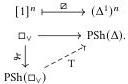

34

E. Cavallo and C. Sattler

Definition 4.35 (Triangulation) Define $\varnothing: \square_{\vee} \to \mathrm{PSh}(\Delta)$ to be the functor sending the $n$-cube $[1]^n$ to the $n$-fold product $(\Delta^1)^n$ of the 1-simplex, with the evident functorial action. The triangulation functor $\mathrm{T}: \mathrm{PSh}(\square_{\vee}) \to \mathrm{PSh}(\Delta)$ is the left Kan extension of $\varnothing$:

Triangulation has a right adjoint, the nerve functor $N_{\varnothing}: \mathrm{PSh}(\Delta) \to \mathrm{PSh}(\square_{\vee})$ defined by $N_{\varnothing}X := \mathrm{PSh}(\Delta)(\varnothing -, X)$.

### 4.3 Idempotent completion

Although the triangulation adjunction $\mathrm{T} \dashv N_{\varnothing}$ is the most immediate means of comparing $\overline{\square}_{\vee}^{\mathrm{N}}$ and $\widehat{\Delta}^{\mathrm{kq}}$, it is not the most convenient. Ideally, we would like to have a comparison on the level of the base categories, some functor $i: \Delta \to \square_{\vee}$ or vice versa, in which case we would obtain an adjoint triple $i_1 \dashv i^* \dashv i_*$ on their presheaf categories. This is too much to hope for, but we can define an embedding from $\Delta$ into the idempotent completion of $\square_{\vee}$, following the strategy used by Sattler [Sat19] and Streicher and Weinberger [SW21] to relate $\Delta$ and $\square_{\wedge \vee}$. The category of presheaves on any category $\mathbf{C}$ is equivalent to the category of presheaves on its idempotent completion $\overline{\mathbf{C}}$, the closure of $\mathbf{C}$ under splitting of idempotents [BD86]. We shall exhibit an embedding $\blacktriangle: \Delta \to \overline{\square}_{\vee}$; by composing the triple $\blacktriangle_1 \dashv \blacktriangle^* \dashv \blacktriangle_*$ with the adjoint equivalence $\blacksquare^*: \mathrm{PSh}(\overline{\square}_{\vee}) \xleftarrow{\mathrm{T}} \mathrm{PSh}(\square_{\vee}): \blacksquare_1$, we obtain a triple relating $\mathrm{PSh}(\Delta)$ and $\mathrm{PSh}(\square_{\vee})$.

We then observe that $\mathrm{T} \cong \blacktriangle^*\blacksquare_1$ (Lemma 4.48); thus the upshot of this detour is that $\mathrm{T}$ is also a right adjoint. It will, however, be easier to study the adjunction $\blacktriangle_1 \dashv \blacktriangle^*$ than $\mathrm{T} \dashv N_{\varnothing}$, in particular because both $\blacktriangle_1$ and $\blacktriangle^*$ are left Quillen adjoints (Corollary 4.53 and Lemma 4.54). We will first show in Section 7.1 that $\blacktriangle_1 \dashv \blacktriangle^*$ is a Quillen equivalence, then deduce formally that $\blacktriangle^* \dashv \blacktriangle_*$ and $\mathrm{T} \dashv N_{\varnothing}$ are also Quillen equivalences.

Definition 4.36 An idempotent in a category $\mathbf{C}$ is a morphism $f: A \to A$ such that $ff = f$. A splitting for an idempotent is a section-retraction pair $(s, r)$ such that $f = sr$.

The splitting of an idempotent is unique up to isomorphism if it exists: $s$ is the equalizer of the pair $f$, id: $A \to A$, while $r$ is the coequalizer of the same. We say that $\mathbf{C}$ is idempotent complete if every idempotent splits.

Definition 4.37 An idempotent completion of a category $\mathbf{C}$ is a fully faithful functor $i: \mathbf{C} \to \overline{\mathbf{C}}$ such that $\overline{\mathbf{C}}$ is idempotent complete and every object in $\overline{\mathbf{C}}$ is a retract of $iA$ for some $A \in \mathbf{C}$.

Equivalently, an idempotent completion is a universal (in a bicategorical sense) fully faithful functor $\mathbf{C} \to \overline{\mathbf{C}}$ into an idempotent complete category. We shall only need the following consequence of this characterization:

2025/10/16 00:43