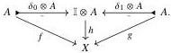

Relative Elegance and Cartesian Cubes with One Connection

37

simplices). As $(\blacktriangle_{a})_{1}$ is a left adjoint, it therefore suffices to show that it sends boundary inclusions to monomorphisms. The boundary inclusion $\partial\Delta^{n}\mapsto\Delta^{n}$ is the joint image of the non-identity face maps $\Delta^{k}\xrightarrow{s}\Delta^{n}$. The joint image of a set of maps $(f_{i}:A_{i}\to B)_{i\in I}$ in any pretopos is computed as the coequalizer of

$$\coprod_{i,j\in I}A_{i}\times_{B}A_{j}\longrightarrow\coprod_{i\in I}A_{i}.$$

It therefore suffices to check that $(\blacktriangle_{a})_{1}$ sends face maps to monomorphisms and preserves pullbacks of cospans whose legs are face maps. As face maps are monic, the latter condition implies the former. For the latter condition, as face maps go between representables and $\Delta_{a}$ has these pullbacks, it suffices to check that $\blacktriangle_{a}$ preserves pullbacks of cospans whose legs are face maps. In fact $\blacktriangle_{a}$ creates such pullbacks, as any subposet of a linear poset is again linear.

The following statements can be phrased more generally at the level of cylinder objects in a model category. They also have evident dual version in terms of path objects with fibrancy assumptions instead.

Lemma 4.50 In a cylindrical model category, let maps $f,g:A\to X$ be related by a homotopy $h:\mathbb{I}\otimes A\to X$. If $A$ is cofibrant, then $f$ is a weak equivalence exactly if $g$ is.

Proof The top maps in the following diagram are trivial cofibrations because $A$ is cofibrant:

The claim follows using 2-out-of-3.

In a cylindrical model category, a homotopy retract is a pair of maps $s:X\to Y,r:Y\to X$ equipped with a homotopy $h:\mathbb{I}\otimes X\to X$ from $rs$ to $\mathrm{id}_{X}$.

Corollary 4.51 In a cylindrical model category, any cofibrant homotopy retract of a weakly contractible object is weakly contractible.

Proof Let a homotopy retract $s:X\to Y,r:Y\to X,h:\mathbb{I}\otimes X\to X$ from $rs$ to $\mathrm{id}_{X}$ be given with $X$ cofibrant and $Y$ weakly contractible. By Lemma 4.50, $rs$ is a weak equivalence. Since $Y$ is weakly contractible, any endomorphism on $Y$ is a weak equivalence by 2-out-of-3. As the two binary sub-composites of the ternary composite $X\xrightarrow{s}Y\xrightarrow{r}X\xrightarrow{s}Y$ are weak equivalences, both $r$ and $s$ are weak equivalences by 2-out-of-6 [Rie14, Remark 2.1.3].

Lemma 4.52 Consider a model category $\mathbf{M}$ and a left adjoint $L:\widehat{\Delta}^{\mathrm{leq}}\to \mathbf{M}$ that preserves cofibrations. Then $L$ is a left Quillen adjoint exactly if it sends representables to weakly contractible objects.

2025/10/16 00:43