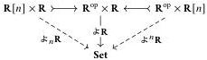
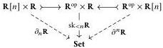

Relative Elegance and Cartesian Cubes with One Connection

41

Proof By cocontinuity, it suffices to check the case where W is representable.

Notation 5.8 In this section, we use the notation $\nexists C: C^{\mathrm{op}} \times C \to \mathbf{Set}$ for the hombifunctor $C(-, -)$. Thus the representable functor for $c \in C$, written $\nexists c$ in our usual notation, may now be written as $\nexists C^c$, while we also have the co-representable $\nexists C_c: C \to \mathbf{Set}$. With our notation for parameterized weighted colimits, Proposition 5.6 then tells us that $\nexists C \circledast_C X \cong X$ for any $X \in \mathrm{PSh}(C)$. We have an analogous equation in the second argument: $X \circledast_C \nexists C \cong X$.

### 5.1.2 Cellular presentations of presheaves

A central theorem of Reedy theory is the existence of cellular presentations: when $\mathbf{R}$ is a Reedy category, any $\mathbf{R}$-indexed diagram is a sequential colimit of maps that successively attach cells of increasing degree. Likewise, any natural transformation between $\mathbf{R}$-indexed diagrams decomposes as a transfinite composite of such maps. In the Riehl–Verity style, the intermediate objects and maps are obtained by taking (Leibniz) weighted colimits of the input diagram. As $X \cong \nexists \mathbf{R} \circledast_{\mathbf{R}^{\mathrm{op}}} X$ for any diagram $X$, one can exhibit a cellular presentation for $X$ by constructing a cellular presentation for $\nexists \mathbf{R}$ and then applying the cocontinuous functor $(-) \circledast_{\mathbf{R}^{\mathrm{op}}} X$.

For the remainder of this section, we fix a Reedy category $\mathbf{R}$.

Definition 5.9 For each $n \in \mathbb{N}$, define $\partial \mathbf{R}: \mathrm{sk}_{<n}\mathbf{R} \mapsto \nexists \mathbf{R}$ to be the subfunctor of arrows of degree less than $n$.

Definition 5.10 For any $n \in \mathbb{N}$, write $\mathbf{R}[n]$ for the subcategory of $\mathbf{R}$ consisting of objects of degree $n$ and isomorphisms between them. We introduce the following notation for restrictions of $\nexists \mathbf{R}$ where one argument or the other is required to have a given degree:

We similarly introduce notation for the corresponding restrictions of the skeleton bifunctor $\mathrm{sk}_{<n}\mathbf{R}: \mathbf{R}^{\mathrm{op}} \times \mathbf{R} \to \mathbf{Set}$:

Finally, we write $\partial_n \mathbf{R}: \partial_n \mathbf{R} \mapsto \nexists_n \mathbf{R}$ and $\partial^n \mathbf{R}: \partial^n \mathbf{R} \mapsto \nexists^n \mathbf{R}$ for the restrictions of the inclusion $\partial \mathbf{R}: \mathrm{sk}_{<n}\mathbf{R} \mapsto \nexists \mathbf{R}$.

Notation 5.11 For $r \in \mathbf{R}$ of degree $n$, we abbreviate $\partial_r \mathbf{R} := (\mathrm{sk}_{<n}\mathbf{R})_r: \mathbf{R} \to \mathbf{Set}$ and $\partial^r \mathbf{R} := (\mathrm{sk}_{<n}\mathbf{R})^r: \mathbf{R}^{\mathrm{op}} \to \mathbf{Set}$. Likewise, we write $\partial_r \mathbf{R} := (\partial \mathbf{R})_r: \partial_r \mathbf{R} \mapsto \nexists \mathbf{R}_r$ and $\partial^r \mathbf{R} := (\partial \mathbf{R})^r: \partial^r \mathbf{R} \mapsto \nexists \mathbf{R}^r$.

2025/10/16 00:43