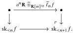
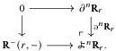

Relative Elegance and Cartesian Cubes with One Connection

43

Proposition 5.15 (Rie17, Corollary 4.21) For any $f: X \to Y$ and $n \in \mathbb{N}$, we have a pushout square of the following form:

We refer to the maps $\partial^n\mathbf{R}\widehat{\otimes}_{\mathbf{R}[n]\mathrm{op}}\widehat{\ell}_n f$ as cell maps.

Proof By applying $(-)\widehat{\otimes}_{\mathbf{R}^{\mathrm{op}}}f$ to a pushout square in $\mathbf{R}^{\mathrm{op}}\times \mathbf{R}\to \mathbf{Set}$; see [Rie17, Theorem 4.15].

Corollary 5.16 Every $f: X \to Y$ in $\mathrm{PSh}(\mathbf{R})$ has a cellular presentation by maps of the form $\partial^n\mathbf{R}\widehat{\otimes}_{\mathbf{R}[n]\mathrm{op}}\widehat{\ell}_nf$.

For our purposes, namely working with properties saturated by monomorphisms, it is important to know when the cell maps are monic.

Definition 5.17 A map $f: X \to Y$ in $\mathrm{PSh}(\mathbf{R})$ is a Reedy monomorphism when $\widehat{\ell}_r f$ is monic in Set for all $r \in \mathbf{R}$.

Here and in the following, we are specializing the theory of Reedy cofibrations to the (mono, epi) weak factorization system on Set. To see when Reedy monomorphisms have monic cell maps, we use the following lemma. Recall that a map is epi-projective if it has the left lifting property against all epimorphisms.

Proposition 5.18 Let $\mathbf{C}$ be a small category, $f \in [\mathbf{C}^{\mathrm{op}}, \mathbf{Set}]^{\rightarrow}$, and $g \in [\mathbf{C}, \mathbf{Set}]^{\rightarrow}$. If $f$ is epi-projective and $g$ is monic, then $f \widehat{\otimes}_{\mathbf{C}} g$ is monic.

Proof By [Rie17, Lemma 3.13 and Corollary 3.17] applied to the (mono, epi) weak factorization system on Set.

Lemma 5.19 If isos act freely on lowering maps in $\mathbf{R}$, then $\partial^n\mathbf{R}_r$ is epi-projective in $\mathbf{R}[n] \to \mathbf{Set}$.

Proof A given morphism from $r$ to an object of degree $n$ is either a lowering map or has degree less than $n$. This induces the following coproduct decomposition in $\mathbf{R}[n] \to \mathbf{Set}$:

Since epi-projective is the left class in a weak factorization system, it is stable under cobase change. It thus suffices to show that $\mathbf{R}^{-}(r, -)$ is epi-projective. Since isos act

2025/10/16 00:43