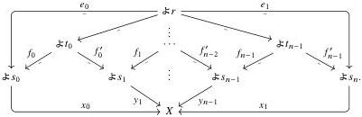

Relative Elegance and Cartesian Cubes with One Connection

45

Proof Suppose that $X$ is Reedy monic. We show that any two EZ decompositions of any $x \in X_r$ are isomorphic by induction on $|r|$. Let two such factorizations $(e_0, x_0)$, $(e_1, x_1)$ be given. If either of $e_0$ or $e_1$ is an isomorphism, then the other must be as well, in which case the factorizations are trivially isomorphic; thus we can assume that each $e_k$ strictly decreases degree. Then $(e_0, x_0)$ and $(e_1, x_1)$ belong to $L_r X_-$; because $X$ is Reedy monic, they are moreover equal therein. By the concrete characterization of colimits in Set, we have a finite sequence of lowering spans $s_i \xleftarrow{f_i} t_i \xrightarrow{f'_i} s_{i+1}$ for $0 \le i < n$, always with $|s_i|, |t_i| < |r|$, together with elements $y_i: \not\cong s_i \to X$ for each $i \le n$, such that $y_0 = x_0, y_n = x_1$, and $y_i f_i = y_{i+1} f'_i$:

By taking an EZ decomposition of each $y_i$ and absorbing the lowering map into $f'_i, f_{i+1}$, we can assume without loss of generality that each $y_i$ is non-degenerate. Then for each $i$, the equation $y_i f_i = y_{i+1} f'_i$ makes $(y_i, f_i)$ and $(y_{i+1}, f'_i)$ EZ decompositions of the same element of $X_{t_i}$. As $|t_i| < |r|$, it follows by induction hypothesis that they are isomorphic. Chaining these isomorphisms, we conclude that $(e_0, x_0)$ and $(e_1, x_1)$ are isomorphic.

Now suppose conversely that $X$ has unique EZ decompositions. By Proposition 5.23, it suffices to show the map $L_r X_- \to X_r$ is monic. The elements of $L_r X_-$ are pairs $(e: r \to s, x \in X_s)$ where $e$ is a strictly lowering map, quotiented by the relation $(fe, x) = (e, xf)$ for any $f \in \mathbf{R}^-$; the latching map sends $(e, x)$ to $xe \in X_r$. Let $(e_0, x_0), (e_1, x_1) \in L_r X_-$ be given such that $x_0 e_0 = x_1 e_1$. Without loss of generality, we may assume that these are EZ decompositions, in which case they are isomorphic and thus equal as elements of $L_r X_-$.

### 5.1.4 Saturation by monomorphisms

Now we check that the class of Reedy monic presheaves is contained in the saturation by monos of the set of automorphism quotients of representables, assuming isos act freely on lowering maps in $\mathbf{R}$.

Lemma 5.25 For any $X \in \mathrm{PSh}(\mathbf{R}[n])$, the presheaf $\not\cong^n \mathbf{R} \circledast_{\mathbf{R}[n]^op} X$ is a coproduct of automorphism quotients of representables.

Proof Write $\mathbf{R}[n]$ as a coproduct of groups $\mathbf{R}[n] \cong \coprod_i G_i$. Using the characterization of orbits as quotients by stabilizer groups, we may decompose $X$ as a coproduct of orbits $X \cong \coprod_{i,j} \not\cong r_i / H_{ij}$, where $r_i \in \mathbf{R}$ is the point of $G_i$. By cocontinuity of $\not\cong^n \mathbf{R} \circledast_{\mathbf{R}[n]^op} (-)$, we then have

$$\not\cong^n \mathbf{R} \circledast_{\mathbf{R}[n]^op} X \cong \coprod_{i,j} (\not\cong^n \mathbf{R} \circledast_{\mathbf{R}[n]^op} \not\cong r_i) / H_{ij} \cong \coprod_{i,j} \not\cong r_i / H_{ij}$$

2025/10/16 00:43