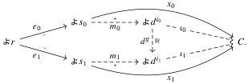
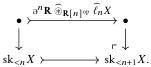
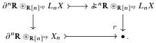

46

E. Cavallo and C. Sattler

as desired.

Lemma 5.26 Any colimit of a groupoid of representables in PSh(R) is Reedy monic.

Proof Let a groupoid G and d: G → R be given. Set C := colim_{i∈G} ∉ d^i. We show that C has unique EZ decompositions. Let two EZ decompositions (e_0, x_0) and (e_1, x_1) of the same element of C be given. As colimits are computed pointwise, each x_k factors as x_k = i_k m_k through some leg i_k: ∉ d^{i_k} → C of the coproduct and we have an arrow g: i_0 ≅ i_1 in G making the following diagram commute:

Each m_k must be a raising map because x_k is non-degenerate. By uniqueness of Reedy factorizations, we have an isomorphism θ: s_0 ≅ s_1 fitting in the diagram above.

Theorem 5.27 Let R be a Reedy category in which isos act freely on lowering maps. Let P ⊆ PSh(R) be a class of objects such that

- for any r ∈ R and H ≤ Aut_R(r), we have ∉ r/H ∈ P;
- P is saturated by monomorphisms.

Then P contains every Reedy monic presheaf.

Proof First we show by induction on n that sk_{<n}X ∈ P for any Reedy monic presheaf X. It then follows that X ≅ colim_{n∈N} sk_{<n}X ∈ P by saturation.

In the base case, sk_{<0}X is the empty coproduct and thus belongs to P by saturation. For any n ∈ N, we have the following pushout square by Proposition 5.15:

The upper horizontal map is monic by Corollary 5.20, the lower by closure of monos in PSh(R) under cobase change. We have sk_{<n}X ∈ P by induction hypothesis. The upper-right corner is ∉^n R ⊗_{R[n]op} X_n, which belongs to P by Lemma 5.25. Finally, the upper-left corner is by definition the following pushout object:

2025/10/16 00:43