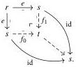

Relative Elegance and Cartesian Cubes with One Connection

47

The upper horizontal map is monic by Proposition 5.18 and Lemma 5.19, as we can write it as the pushout product $\partial^n\mathbf{R}\circledast_{\mathbf{R}[n]^{\mathrm{op}}}(\emptyset \mapsto L_nX)$. The object $\not\perp^n\mathbf{R}\circledast_{\mathbf{R}[n]^{\mathrm{op}}}L_nX$ is in $\mathcal{P}$ by Lemma 5.25. Using Corollary 5.7, we have

$$\partial^n\mathbf{R}\circledast_{\mathbf{R}[n]^{\mathrm{op}}}F\cong(\mathrm{sk}_{<n}\mathbf{R}\circledast_{\mathbf{R}^{\mathrm{op}}}\not\perp^n\mathbf{R})\circledast_{\mathbf{R}[n]^{\mathrm{op}}}F\cong\mathrm{sk}_{<n}\mathbf{R}\circledast_{\mathbf{R}^{\mathrm{op}}}(\not\perp^n\mathbf{R}\circledast_{\mathbf{R}[n]^{\mathrm{op}}}F)$$

for any $F$. The objects $\partial^n\mathbf{R}\circledast_{\mathbf{R}[n]^{\mathrm{op}}}L_nX$ and $\partial^n\mathbf{R}\circledast_{\mathbf{R}[n]^{\mathrm{op}}}X_n$ thus belong to $\mathcal{P}$ by Lemmas 5.25 and 5.26 and the induction hypothesis. By saturation, the upper-left corner of our original pushout diagram now belongs to $\mathcal{P}$. For the same reason, we conclude that $\mathrm{sk}_{<n+1}X$ belongs to $\mathcal{P}$.

## 5.2 Pre-elegant Reedy categories

We next consider the subclass of Reedy categories in which any span of lowering maps has a pushout. This restriction has some simplifying consequences (e.g., that all lowering maps are epic), and we can characterize the Reedy monic presheaves over such categories as those preserving lowering pushouts.

Definition 5.28 A Reedy category is pre-elegant when it has pushouts of lowering spans.

Intuitively, this means that any pair of lowering maps from the same object has a universal combination, the diagonal of their pushout. Of course, any elegant Reedy category is pre-elegant, so $\Delta$ is one example. Our motivating example is the (surjective, mono) Reedy structure on the category of finite inhabited semilattices, which is pre-elegant but not elegant. In Section 6, we see this is an instance of a general class of examples: the (surjective, mono) Reedy structure on the category $\mathrm{Alg}(\mathbf{T})_{\mathrm{fin}}$ of finite algebras for a Lawvere theory $\mathbf{T}$ is always pre-elegant, but not necessarily elegant.

The following lemma generalizes the fact that any lowering map in an elegant Reedy category is split epic, with essentially the same proof as Bergner and Rezk's Proposition 3.8(3) [BR13].

Lemma 5.29 Let $\mathbf{R}$ be a pre-elegant Reedy category. Then any lowering map is epic.

Proof Consider a lowering map $e: r \xrightarrow{\quad} s$. We take the pushout of $e$ with itself, then use its universal property to see that the legs of the pushout are split monic:

Any split mono is a raising map (Corollary 2.15), so $f_0, f_1$ are isomorphisms. Thus $e$ is epic.

2025/10/16 00:43