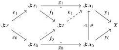
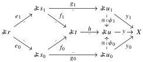

48

E. Cavallo and C. Sattler

Corollary 5.30 If R is a pre-elegant Reedy category, then isos act freely on lowering maps in R.

Lemma 5.31 Let R be a Reedy category in which isos act freely on lowering maps. If X ∈ PSh(R) is Reedy monic, then X sends pushouts of lowering spans (should they exist) to pullbacks.

Proof Let a pushout square of lowering maps be given like so:

$$\begin{array}{c} r \xrightarrow{e_1} s_1 \\ e_0 \Biggl\downarrow \quad \quad \quad \quad \quad \quad \quad \quad \quad \quad \quad \quad \quad \quad \quad \quad \quad \quad \quad \quad \quad \quad \quad \quad \quad \quad \quad \quad \quad \quad \quad \quad \quad \quad \quad \quad \quad \quad \quad \quad \quad \quad \quad \quad \quad \quad \quad \quad \quad \quad \text { f } _ {1} \\ s _ {0} \xrightarrow{f _ {0}} t. \end{array}$$

Suppose we have x₀ ∈ Xₛ₀ and x₁ ∈ Xₛ₁ such that x₀e₀ = x₁e₁; we show this data determines a unique element of Xₜ restricting to x₀ and x₁. For each k ∈ {0, 1}, take an EZ decomposition (gₖ, yₖ) of xₖ. Then (g₀e₀, y₀) and (g₁e₁, y₁) are EZ decompositions of the same map, so by Lemma 5.24 they are isomorphic via some θ: u₀ ≅ u₁. The universal property of the pushout in R then provides a map h₁: t → u₁ like so:

This gives our desired element y₁h₁ ∈ Xₜ restricting to xₖ along each fₖ. Note that h₁ is a lowering map by Lemma 2.14.

To see that this element is unique, suppose we have x ∈ Xₜ such that xfₖ = xₖ for k ∈ {0, 1}. Take an EZ decomposition (h, y) of X, say through u ∈ R. By uniqueness of EZ decompositions, we have isomorphisms ψₖ as shown:

Because isos act freely on lowering maps, we have ψ₁⁻¹ψ₀ = θ. It follows from the universal property of the pushout in R that ψ₁h = h₁, thus that yh = y₁h₁ as desired.

Theorem 5.32 If R is a pre-elegant Reedy category, then X ∈ PSh(R) is Reedy monic if and only if it sends pushouts of lowering spans to pullbacks.

2025/10/16 00:43