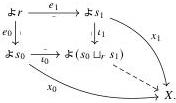
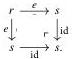

Relative Elegance and Cartesian Cubes with One Connection

49

Proof One direction is Lemma 5.31. For the other, suppose X sends pushouts of lowering spans to pullbacks. By Lemma 5.24, it suffices to show X has unique EZ decompositions. Let (e₀, x₀) and (e₁, x₁) be EZ decompositions of the same element. We have an induced element as shown:

By non-degeneracy of x₀ and x₁, the maps ι₀ and ι₁ must be isomorphisms, so (e₀, x₀) and (e₁, x₁) are isomorphic.

Remark 5.33 A corollary of the previous theorem is that a pre-elegant Reedy category R is elegant if and only if all presheaves on R are Reedy monic. Bergner and Rezk [BR13, Proposition 3.8] show that this bi-implication actually holds for any Reedy category. That is, if all presheaves on R are Reedy monic, then R is necessarily pre-elegant (and thus elegant).

### 5.3 Relative elegance

Now we come to our central definition, elegance of a category relative to a full subcategory.

Definition 5.34 We say that a pre-elegant Reedy category R is elegant relative to a fully faithful functor i: C → R if the nerve Nᵢ := i*&: R → PSh(C) preserves pushouts of lowering spans. We also say that i is relatively elegant with the same meaning.

Remark 5.35 As pushouts in PSh(C) are computed pointwise, i is relatively elegant if and only if R(ia, −): R → Set preserves lowering pushouts for all a ∈ C.

Remark 5.36 A Reedy category is elegant if and only if it is elegant relative to the identity functor, in which case the nerve is simply the Yoneda embedding. At the other extreme, any pre-elegant Reedy category is elegant relative to the unique functor 0 → R.

Lemma 5.37 If R is elegant relative to i: C → R, then Nᵢ: R → PSh(C) sends lowering maps to epimorphisms.

Proof By Lemma 5.29, any e ∈ R⁻ fits in the pushout square

2025/10/16 00:43