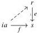

50

E. Cavallo and C. Sattler

which is then preserved by $N_i$.

Corollary 5.38 If $\mathbf{R}$ is elegant relative to $i: \mathbf{C} \to \mathbf{R}$, then objects in the image of $i$ are $\mathbf{R}^-$-projective: given a lowering map $e: r \to s$ and $f: ia \to s$, there exists a lift as below.

Proof By Lemma 5.37, $N_i e: N_i r \to N_i s$ is epic; this means exactly post-composition with $e$ is a surjective map $\mathbf{R}(ia, r) \to \mathbf{R}(ia, s)$.

Remark 5.39 As a special case of the corollary above, we recover the fact that lowering maps in elegant Reedy categories are split epimorphisms [BR13, Proposition 3.8]. Split epis are lowering maps in any Reedy category (Corollary 2.15), so in the elegant case they coincide. It is not generally the case that the lowering maps in a Reedy category $\mathbf{R}$ elegant relative to some $i$ are exactly those sent to epimorphisms by $N_i$: consider that $\mathbf{R}$ is always elegant relative to $\mathbf{0} \to \mathbf{R}$.

On the basis of Remark 5.35, we can identify the maximal subcategory relative to which a pre-elegant Reedy category $\mathbf{R}$ is elegant.

Definition 5.40 Let $\mathbf{R}$ be a pre-elegant Reedy category. We define its elegant core $\mathbf{R}^{\mathrm{ec}}$ to be the full subcategory of $\mathbf{R}$ consisting of objects $r$ such that $\mathbf{R}(r, -)$ preserves lowering pushouts.

Proposition 5.41 An fully faithful functor $i: \mathbf{C} \to \mathbf{R}$ into a pre-elegant Reedy category is relatively elegant exactly if it factors through the inclusion $\mathbf{R}^{\mathrm{ec}} \to \mathbf{R}$.

We can give another characterization of relative elegance in terms of the right Kan extension $i_*: \mathrm{PSh}(\mathbf{C}) \to \mathrm{PSh}(\mathbf{R})$:

Lemma 5.42 Let $\mathbf{R}$ be a pre-elegant Reedy category. Then $i: \mathbf{C} \to \mathbf{R}$ is relatively elegant if and only if $i_* X \in \mathrm{PSh}(\mathbf{R})$ is Reedy monic for every $X \in \mathrm{PSh}(\mathbf{C})$.

Proof By definition, $i: \mathbf{C} \to \mathbf{R}$ is relatively elegant exactly if $N_i = i^* \not\cong$ preserves lowering pushouts. Testing pushouts by mapping out of them, this holds exactly if $\mathrm{PSh}(\mathbf{C})(i^* \not\cong -, X)$ sends lowering pushouts to pullbacks for every $X \in \mathrm{PSh}(\mathbf{C})$. Using the natural isomorphism

$$\mathrm{PSh}(\mathbf{C})(i^* \not\cong -, X) \cong \mathrm{PSh}(\mathbf{R})(i \not\cong -, i_* X) \cong i_* X,$$

this rewrites to $i_* X$ sending lowering pushouts to pullbacks.

This property of presheaves extends to morphisms as follows.

2025/10/16 00:43