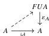

54

E. Cavallo and C. Sattler

- • perfectly presentable if $\mathbf{C}(A, -): \mathbf{C} \rightarrow \mathbf{Set}$ preserves sifted colimits.

**Proposition 6.9** (*ARV10, Corollary 5.16 and Proposition 11.28*) Let $A \in \text{Alg}(\mathbf{T})$. The following are equivalent:

- • $A$ is perfectly presentable;
- • $A$ is finitely presentable and regular projective;
- • $A$ is a retract of a finitely-generated free algebra.

**Theorem 6.10** Suppose that every finitely-generated free algebra in $\text{Alg}(\mathbf{T})$ has a finite underlying set. Then the elegant core of $\text{Alg}(\mathbf{T})_{\text{fin}}^{(\text{inh})}$ is the subcategory of objects perfectly presentable in $\text{Alg}(\mathbf{T})$.

**Proof** Suppose $A \in \text{Alg}(\mathbf{T})_{\text{fin}}^{(\text{inh})}$ is in the elegant core of the Reedy structure. By assumption, the free algebra $FUA$ belongs to $\text{Alg}(\mathbf{T})_{\text{fin}}^{(\text{inh})}$, and the counit $\varepsilon_A: FUA \rightarrow A$ is clearly surjective. Then by Corollary 5.38, we have a lift

exhibiting $A$ a retract of a free algebra. Thus $A$ is perfectly presentable. Conversely, if $A$ is perfectly presentable, then $\text{Alg}(\mathbf{T})(A, -): \text{Alg}(\mathbf{T}) \rightarrow \mathbf{Set}$ preserves finite limits and sifted colimits, so preserves pushouts of lowering spans by Lemma 6.6.

## 6.2 Semilattice cubes

Applying the preceding results, we have a (surjective, mono) Reedy structure on $\mathbf{SLat}_{\text{fin}}^{(\text{inh})}$. We can give a concrete description of its elegant core.

**Lemma 6.11** A semilattice $A \in \mathbf{SLat}_{\text{fin}}^{(\text{inh})}$ is in the elegant core of the (surjective, mono) Reedy structure if and only if $1 \star A$ is a distributive lattice.

**Proof** By Theorem 6.10, the elegant core consists of the perfectly presentable objects in $\mathbf{SLat}$. By Proposition 6.9, these are the finite regular projectives in $\mathbf{SLat}$. These are characterized as above by Propositions 4.41 and 4.42.

**Theorem 6.12** The inclusion $i: \overline{\square}_v \rightarrow \mathbf{SLat}_{\text{fin}}^{(\text{inh})}$ is relatively elegant.

**Proof** If $A \in \mathbf{SLat}_{\text{fin}}^{(\text{inh})}$ is a distributive lattice, then $1 \star A$ is a distributive lattice as well, so $A$ is in the elegant core of $\mathbf{SLat}_{\text{fin}}^{(\text{inh})}$.

**Remark 6.13** The subcategory $\mathbf{SLat}_{\text{fin}}^{\perp}$ of $\mathbf{SLat}_{\text{fin}}^{(\text{inh})}$ consisting of finite semilattices with a minimum element is closed under Reedy factorizations and lowering pushouts, so

2025/10/16 00:43