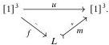

60

E. Cavallo and C. Sattler

Corollary 7.24 The fibrations in $\overline{\overline{\square}}_{\vee}^{\mathrm{test}}$ and $\overline{\square}_{\vee}^{\mathrm{test}}$ are those maps lifting against $\delta_k \widehat{\times} m$ for all $k \in \{0, 1\}$ and $m: A \mapsto B$.

## A Negative results

Here we collect a pair of negative results concerning the existence of (relative) Reedy structures on (idempotent completions of) cube categories. In Appendix A.1, we check that $\square_{\vee}$ and $\overline{\square}_{\vee}$ are not Reedy categories, motivating this paper's approach. Appendix A.2 concerns the limits of relative elegance: we show that the Dedekind cube category does not embed elegantly in any Reedy category.

### A.1 Semilattice cubes

The non-existence of a Reedy structure on $\square_{\vee}$ is easily verified: every Reedy category is idempotent complete [Bor94, Proposition 6.5.9], but we have seen in Section 4.3 that $\square_{\vee}$ is not. The map $(x, y) \mapsto (x, x \vee y): [1]^2 \to [1]^2$ is a simple example of an idempotent with no splitting in $\square_{\vee}$.

It is therefore more appropriate to ask if the cube category's idempotent completion $\overline{\square}_{\vee}$, which we have characterized as the full subcategory of SLat consisting of finite inhabited distributive lattices (Definition 4.39), is Reedy. If this were so, we could simply study PSh($\square_{\vee}$) by way of the equivalent PSh($\overline{\square}_{\vee}$). However, this is not the case:

Proposition A.1 There is no Reedy structure on $\overline{\square}_{\vee}$.

Proof We consider the following morphism $u: [1]^3 \to [1]^3$:

$$u(x, y, z) := (x \vee y, y \vee z, z \vee x).$$

For intuition, note that the image of $u$ computed in SLat is the non-distributive diamond lattice $\mathfrak{M}_3$.

Suppose that we do have a Reedy structure on $\overline{\square}_{\vee}$. The unique map $[1]^2 \to 1$ is split epic and thus a lowering map (Corollary 2.15). Every raising map must have the right lifting property against this map, so every raising map is monic.⁸ Take a Reedy factorization of $u$:

$L$ is a sub-semilattice of $[1]^3$ that forms a distributive lattice and contains the image of $u$. Note that $\vee, \bot$, and $\top$ are computed in $L$ as in $[1]^3$, but $\wedge$ may not be; we write $\wedge_L$ for the meet in $L$. We show that in fact $L = [1]^3$.

⁸If we only want to show $\overline{\square}_{\vee}$ is not elegant Reedy, we are already done, as observed in [Cam23, Theorem 8.12(2)]: if $\overline{\square}_{\vee}$ were elegant we would have a (split epi, mono) factorization of $u$, which would necessarily be preserved by the inclusion $\overline{\square}_{\vee} \to \mathbf{SLat}$, but $u$'s (split epi, mono) factorization in SLat is $\mathfrak{M}_3$.

2025/10/16 00:43