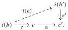
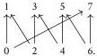
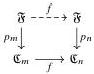

Relative Elegance and Cartesian Cubes with One Connection

63

of $i$, we obtain a lift as below:

Then $f = f'h$, so $\langle f \rangle \subseteq \langle f' \rangle$.

### A.2.2 Principal sieves in Dedekind cubes

Now we show that the poset of principal sieves on $[1]^3 \in \square_{\mathbb{N}}$ is not well-founded. We embed a poset model of the circle $\mathfrak{C}_n \mapsto [1]^n$ in each cube, then exhibit a chain of subobjects of $[1]^n$ (for any $n \ge 3$) induced by maps $\cdots \to \mathfrak{C}_{n_2} \to \mathfrak{C}_{n_1} \to \mathfrak{C}_n$ that cannot stabilize.

Definition A.6 The fence $\mathfrak{F} \in \mathbf{Pos}$ is the poset whose elements are integers and whose order is generated by the inequalities $i \le i - 1$ and $i \le i + 1$ for all even $i \in \mathbb{Z}$.

Definition A.7 The $n$th crown poset $\mathfrak{C}_n \in \mathbf{Pos}$ is the quotient of $\mathfrak{F}$ identifying $i, j \in \mathfrak{F}$ whenever $i = j \pmod{2n}$. We write $p_n: \mathfrak{F} \to \mathfrak{C}_n$ for the quotient map.

For example, $\mathfrak{C}_4$ is the following poset:

Remark A.8 Each crown poset is freely generated by a graph (though not the graphs usually known as crown graphs, which have more edges).

The simplicial nerve $N_\Delta$ sends each crown poset to a simplicial set weakly equivalent to the circle. As such, any map between crown posets can be associated a winding number. Concretely, we can define the winding number on the level of posets as follows:

Definition A.9 Any poset map $f: \mathfrak{C}_m \to \mathfrak{C}_n$ lifts to an endomap

which is unique modulo $2n$. The winding number of $f$ is

$$\deg(f) := \frac{\mathring{f}(2m) - \mathring{f}(0)}{2n}.$$

2025/10/16 00:43