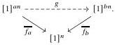
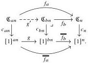

REFERENCES

65

Applying  \( (-) \) , we have a chain of principal sieves  \( \langle\overline{f_{2}}\rangle\supseteq\langle\overline{f_{4}}\rangle\supseteq\langle\overline{f_{8}}\rangle\supseteq\cdots \)  on  \( [1]^{n} \) . By Lemma A.5, this chain must stabilize; in particular, there must be some pair a<b (both powers of 2) such that  \( \langle\overline{f_{a}}\rangle=\langle\overline{f_{b}}\rangle \) . Then there exists a map

By Lemma A.13, we have an induced map of crown posets:

But because an < bn, we must have  \( \deg(g') = 0 \)  by Lemma A.10, which contradicts that  \( \deg(f_b)\deg(g') = \deg(f_a) = a \) .

## References

[ABCHFL21] Carlo Angiuli, Guillaume Brunerie, Thierry Coquand, Robert Harper, Kuen-Bang Hou (Favonia), and Daniel R. Licata, "Syntax and models of Cartesian cubical type theory". In: Math. Structures in Comput. Sci. 31.4 (2021), pp. 424–468. DOI: 10.1017/S0960129521000347.

[ACCRS24] Steve Awodey, Evan Cavallo, Thierry Coquand, Emily Riehl, and Christian Sattler. The equivariant model structure on cartesian cubical sets. 2024. arXiv: 2406.18497 [math.AT].

[AFH18] Carlo Angiuli, Kuen-Bang Hou (Favonia), and Robert Harper. "Cartesian Cubical Computational Type Theory: Constructive Reasoning with Paths and Equalities". In: 27th EACSL Annual Conference on Computer Science Logic, CSL 2018, September 4-7, 2018, Birmingham, UK. Ed. by Dan R. Ghica and Achim Jung, Schloss Dagstuhl – Leibniz-Zentrum für Informatik, 2018, 6:1–6:17. DOI: 10.4230/LIPIcs.CSL.2018.6.

[AGH24] Steve Awodey, Nicola Gambino, and Sina Hazratpour. "Kripke-Joyal forcing for type theory and uniform fibrations". In: Sel. Math. New Ser. 30.74 (2024). DOI: 10.1007/s00029-024-00962-2.

[ARV10] Jiří Adámek, Jiří Rosický, and Enrico M. Vitale. Algebraic Theories: A Categorical Introduction to General Algebra. Cambridge Tracts in Mathematics. Cambridge: Cambridge University Press, 2010. DOI: 10.1017/CBO9780511760754.

[Awo23] Steve Awodey. Cartesian cubical model categories. 2023. arXiv: 2305.00893 [math.CT].

[Awo24] Steve Awodey. "On Hofmann–Streicher universes". In: Math. Structures in Comput. Sci. 34.9 (2024), pp. 894–910. DOI: 10.1017/S0960129524000203.

[Bar19] Reid William Barton. "A model 2-category of enriched combinatorial premodel categories". PhD thesis. Harvard University, 2019. URL: http://nrs.harvard.edu/urn-3:HUL.InstRepos:42013127.

[BC15] Marc Bezem and Thierry Coquand. "A Kripke model for simplicial sets". In: Theoret. Comput. Sci. 574 (2015), pp. 86–91. DOI: 10.1016/j.tcs.2015.01.035.

[BCH13] Marc Bezem, Thierry Coquand, and Simon Huber. "A Model of Type Theory in Cubical Sets". In: 19th International Conference on Types for Proofs and Programs, TYPES 2013, April 22-26,

2025/10/16 00:43